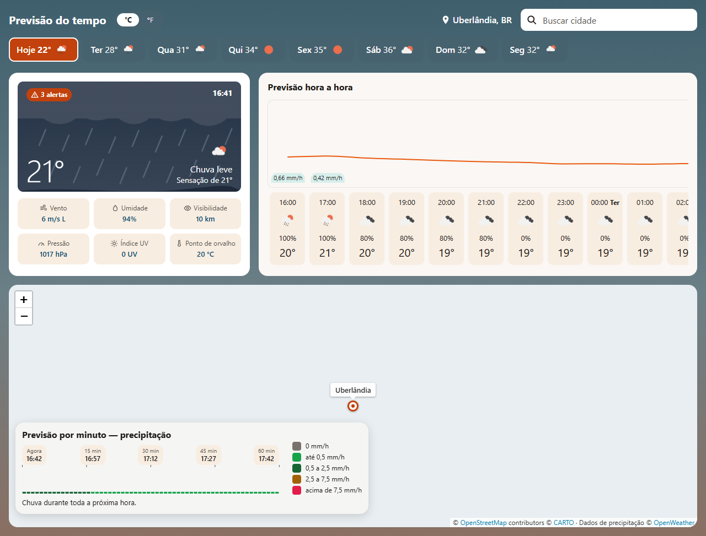
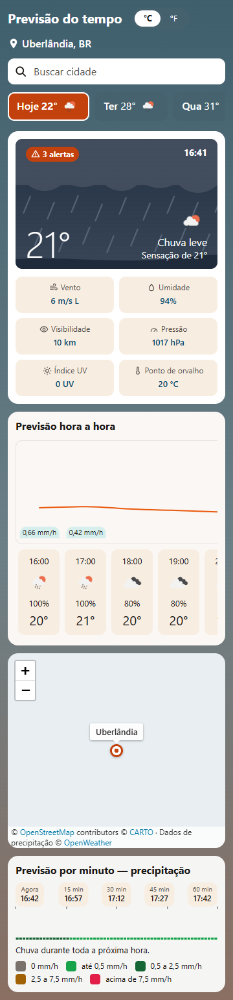

# OpenWeather Dashboard

Dashboard web de página única que consome a API do [OpenWeatherMap](https://openweathermap.org/api) e mostra as **condições atuais**, a **previsão diária**, **hora a hora** e **por minuto** e um **mapa de chuva**. A cidade inicial vem da localização do navegador, e qualquer outra pode ser escolhida no campo de busca.

MVP acadêmico da pós-graduação, desenvolvido com apoio de IA Generativa em todas as etapas do SDLC.

> **Status:** ✅ MVP implementado, testado e documentado, versão final `v1.0.0`. As 7 features do [spec](docs/spec.md) estão prontas, e os 217 IDs rastreáveis (58 RF, 59 RN, 29 RNF, 44 CA e os princípios P-001 a P-027) estão cobertos por testes automatizados. O andamento fatia a fatia está em [docs/tasks.md](docs/tasks.md), e a etapa de Testes, no [relatório de testes](docs/relatorio-testes.md).

---

## Sumário

- [O que o projeto resolve](#o-que-o-projeto-resolve)
- [Funcionalidades](#funcionalidades)
- [Tecnologias utilizadas](#tecnologias-utilizadas)
- [Estrutura do projeto](#estrutura-do-projeto)
- [Pré-requisitos](#pré-requisitos)
- [Configuração do ambiente e execução local](#configuração-do-ambiente-e-execução-local)
- [Exemplos de uso](#exemplos-de-uso)
- [Processo de desenvolvimento com IA](#processo-de-desenvolvimento-com-ia)
- [Como contribuir](#como-contribuir)
- [Limitações e próximos passos](#limitações-e-próximos-passos)
- [Releases](#releases)
- [Créditos](#créditos)

---

## O que o projeto resolve

| Para quem | Problema | Como o dashboard resolve |
|---|---|---|
| Quem quer saber o tempo | A informação costuma estar espalhada (temperatura num site, chance de chuva em outro, radar em outro) ou escondida atrás de cadastro e anúncios | Reúne o essencial em uma tela, sem cadastro, já na localização do usuário |
| Quem vai sair nas próximas horas | A previsão diária não diz **quando** vai chover | Mostra a chance de chuva hora a hora e a intensidade minuto a minuto na próxima hora |
| Quem estuda IA Generativa no SDLC | Falta um caso concreto e pequeno para praticar o ciclo inteiro com IA | Serve de caso de estudo, dos requisitos aos testes, com todos os prompts e decisões registrados |

Detalhes no [product brief](docs/product-brief.md), seção 2.

## Funcionalidades

Escopo do MVP, especificado em [docs/spec.md](docs/spec.md):

- [x] Localização inicial pelo navegador (Uberlândia, BR, se não estiver disponível em 10 s), busca de cidade com até 5 resultados e carregamento dos dados com cache de 10 minutos
- [x] Condições atuais: temperatura, descrição, ilustração do tipo de tempo, sensação térmica, alertas, vento, umidade, visibilidade, pressão, índice UV e ponto de orvalho
- [x] Previsão diária em abas ("Hoje" + 7 dias), com o resumo do dia escolhido no card principal
- [x] Previsão hora a hora (24 horas) com curva de temperatura, chance e volume de chuva
- [x] Previsão por minuto da precipitação na próxima hora, com barras por faixa, legenda e resumo em texto
- [x] Mapa com a camada de precipitação, centrado na cidade selecionada
- [x] Alternância °C/°F, com vento em m/s ou mph, sem nova consulta
- [x] Estados de carregamento, erro com "Tentar novamente" e "indisponível" em cada bloco, e atualização ao voltar à página depois de 10 minutos
- [x] Operação completa pelo teclado, textos em pt-BR e layout a partir de 360 px de largura

## Tecnologias utilizadas

| Camada | Tecnologia | Status |
|---|---|---|
| Fonte de dados | [OpenWeatherMap](https://openweathermap.org/api): One Call API 4.0, Geocoding API e camada de precipitação | ✅ Definido |
| Backend | [Python](https://www.python.org/) 3.13.5 + [FastAPI](https://fastapi.tiangolo.com/) 0.142.2 + [Uvicorn](https://www.uvicorn.org/) 0.54.0 + [httpx](https://www.python-httpx.org/) 0.28.1 | ✅ Definido |
| Frontend | HTML, CSS e JavaScript puro (módulos ES), sem framework e sem build | ✅ Definido |
| Mapa | [Leaflet](https://leafletjs.com/) 1.9.4 + mapa base [CARTO Voyager](https://carto.com/basemaps) (dados © [OpenStreetMap](https://www.openstreetmap.org/copyright)) | ✅ Definido |
| Gráficos | SVG próprio, sem biblioteca | ✅ Definido |
| Testes | [pytest](https://docs.pytest.org/) 9.1.1 + [pytest-playwright](https://playwright.dev/python/) 0.9.0 (Chrome instalado) | ✅ Definido |
| Qualidade de código | [Ruff](https://docs.astral.sh/ruff/) 0.16.10 | ✅ Definido |
| Ambiente | [Anaconda](https://www.anaconda.com/) / conda (canal conda-forge) + pip | ✅ Definido |
| Versionamento | Git + [Conventional Commits](https://www.conventionalcommits.org/pt-br/) | ✅ Definido |
| Assistente de desenvolvimento | [Claude Code](https://claude.com/claude-code) + prompts CO-STAR | ✅ Definido |
| Hospedagem / deploy | Não se aplica: o MVP roda só localmente, em `127.0.0.1` | ✅ Definido |

As versões exatas de todas as dependências estão em [requirements.txt](requirements.txt), [requirements-dev.txt](requirements-dev.txt) e [environment.yml](environment.yml). As decisões e justificativas estão em [docs/arquitetura.md](docs/arquitetura.md).

## Estrutura do projeto

```
openweather-dashboard/
├── .claude/commands/costar.md   # Comando /costar: reescreve pedidos em CO-STAR, registra e executa
├── app/                         # Backend Python (FastAPI): proxy com a chave e regras de negócio
│   ├── main.py                  # create_app: rotas, arquivos estáticos e Cache-Control
│   ├── config.py                # Lê a chave do ambiente e falha sem ela
│   ├── logging_setup.py         # Log próprio sem query string nem coordenadas
│   ├── api/routes.py            # /api/weather, /api/geo/search, /api/geo/reverse e /api/tiles/...
│   ├── clients/openweather.py   # Chamadas ao OpenWeatherMap (One Call 4.0, Geocoding e tiles)
│   ├── domain/                  # Regras puras: formatação, unidades, fuso, condições, chuva, alertas
│   └── schemas/                 # Modelos do provedor e do view model entregue ao navegador
├── static/                      # Frontend: HTML, CSS e JavaScript puro, sem build
│   ├── index.html
│   ├── css/                     # tokens.css (cores e medidas) e styles.css
│   ├── img/conditions/          # Ilustrações próprias por tipo de tempo (SVG)
│   ├── vendor/leaflet-1.9.4/    # Leaflet copiado para o projeto, com SHA-256 conferido
│   └── js/
│       ├── main.js              # Monta os blocos, inicia a localização e acompanha o relógio
│       ├── state.js, actions.js # Estado único e fluxos (única camada que muda o estado)
│       ├── messages.js          # Todos os textos fixos da interface
│       ├── services/            # /api, cache em memória e geolocalização
│       ├── logic/               # Janelas de tempo, resumos e cálculos dos gráficos
│       └── ui/                  # Um módulo por bloco da tela
├── tests/
│   ├── unit/                    # Domínio, schemas, configuração e rastreabilidade dos requisitos
│   ├── api/                     # Rotas, cliente, segurança e fumaça com o provedor real (live)
│   ├── e2e/                     # Ponta a ponta no Chrome, com /api, tiles e relógio simulados
│   └── fixtures/                # Capturas reais da One Call 4.0 e do Geocoding, sem a chave
├── docs/
│   ├── requisitos.md            # Índice dos artefatos de requisitos
│   ├── product-brief.md         # Visão do produto, atores, fluxo de uso e glossário geral
│   ├── constitution.md          # Princípios permanentes (P-xxx)
│   ├── spec.md                  # Especificação por feature (RF, RN, RNF, CA)
│   ├── arquitetura.md           # Stack, decisões (ADR), contratos, convenções, testes e fatias
│   ├── tasks.md                 # Tarefas por fatia, decisões, limitações e progresso
│   ├── plano-testes.md          # Plano da etapa de Testes: fases, critérios e defeitos
│   ├── relatorio-testes.md      # Resultado de cada fase da etapa de Testes
│   ├── prompts-costar.md        # Histórico de prompts por etapa do SDLC
│   ├── capturas/                # Capturas de tela do dashboard
│   └── referencia/referencia_visual.png  # Print de referência visual do layout
├── .env.example                 # Modelo do .env (sem a chave real)
├── environment.yml              # Ambiente conda: Python 3.13.5 + pip
├── requirements.txt             # Dependências de execução, com versões exatas
├── requirements-dev.txt         # Dependências de teste e qualidade, com versões exatas
├── pyproject.toml               # Configuração do pytest, do ruff e do coverage
├── CLAUDE.md                    # Contexto e regras para o Claude Code
└── README.md                    # Este arquivo
```

As responsabilidades e as regras de dependência entre as pastas estão na seção 5 de [docs/arquitetura.md](docs/arquitetura.md).

## Pré-requisitos

- [Git](https://git-scm.com/)
- Uma conta gratuita no [OpenWeatherMap](https://home.openweathermap.org/users/sign_up) com uma **API key**
- A assinatura **"One Call by Call"** da [One Call API 4.0](https://openweathermap.org/api/one-call-4) ativa na conta. Ela inclui 1.000 chamadas gratuitas por dia, e as chamadas acima disso são cobradas. Para não haver cobrança, configure o limite diário de chamadas em 1.000 na aba "Billing plans" da conta. A liberação de uma assinatura nova pode levar algum tempo
- [Anaconda](https://www.anaconda.com/download) ou Miniconda (para o ambiente com Python 3.13.5). Sem conda, serve o [Python 3.13](https://www.python.org/downloads/) com `venv`
- [Google Chrome](https://www.google.com/chrome/), usado pelos testes de ponta a ponta

## Configuração do ambiente e execução local

### 1. Clonar o repositório

```bash
git clone https://github.com/tmoliveira1584/openweather-dashboard.git
cd openweather-dashboard
```

### 2. Obter a API key do OpenWeatherMap

1. Crie uma conta em <https://home.openweathermap.org/users/sign_up>.
2. Abra **API keys** no seu perfil e copie a chave (ou gere uma nova).
3. Uma chave nova pode levar algumas horas para começar a funcionar.

### 3. Configurar as variáveis de ambiente

A API key fica **somente** no arquivo `.env`, que o Git ignora. Nunca coloque a chave no código, em commits ou em prompts. Ela é lida pelo servidor Python e **nunca é enviada ao navegador**.

```bash
copy .env.example .env    # Anaconda Prompt / cmd. No Git Bash: cp .env.example .env
```

Depois, edite o `.env` e preencha a chave.

| Variável | Descrição | Exemplo |
|---|---|---|
| `OPENWEATHER_API_KEY` | API key do OpenWeatherMap | `sua_chave_aqui` |

### 4. Criar o ambiente e instalar as dependências

No **Anaconda Prompt** (ou no PowerShell depois de rodar `conda init powershell` uma vez):

```bash
conda env create -f environment.yml     # cria o ambiente openweather-dashboard (uma vez)
conda activate openweather-dashboard
```

Sem conda: `python -m venv .venv`, ative o ambiente e rode `pip install -r requirements-dev.txt`.

Depois de mudar os requirements: `conda env update -f environment.yml --prune`.

### 5. Rodar localmente

```bash
uvicorn app.main:app --host 127.0.0.1 --port 8000 --env-file .env --no-access-log --reload
```

Depois, abra <http://127.0.0.1:8000>. A documentação automática da API fica em <http://127.0.0.1:8000/docs>.

### 6. Rodar os testes

```bash
pytest -m "not e2e"                       # unidade e API (rápidos, sem internet)
pytest -m e2e                             # ponta a ponta no Chrome instalado
pytest -m live                            # fumaça com o provedor real (usa a cota)
ruff check . && ruff format --check .     # lint e formatação
```

Para medir a cobertura de código (fase 1 do [plano de testes](docs/plano-testes.md)):

```bash
coverage run -m pytest --js-coverage      # suíte completa, medindo o Python e o JavaScript
coverage report                           # Python (app/), por arquivo, com as linhas sem execução
```

A cobertura do JavaScript aparece no fim da execução e fica em `coverage-js/report.txt`. Ela é medida pelo próprio Chrome, sem dependência nova.

Para o teste de mutação de um módulo Python (fase 4 do plano de testes):

```bash
python -m tests.mutation app/domain/precipitation.py tests/unit
```

Os testes de unidade, de API e de ponta a ponta não usam a internet nem a cota: o provedor, as tiles do mapa e o relógio do navegador são simulados. O `pytest -m live` faz cerca de 11 chamadas reais e só roda quando pedido assim: em qualquer outra execução, esses testes ficam de fora ou pulados.

**Resultado da suíte (2026-10-08, versão `v0.1.1`, fim da etapa de Testes):**

| Suíte | Ambiente | Resultado |
|---|---|---|
| `pytest -m "not e2e"` | Python 3.13.5 | 512 testes passando (os 4 `live` ficam pulados) |
| `pytest -m e2e` | Google Chrome 154.0.8037.98 (Windows 11), Playwright 1.63.0 | 340 testes passando, incluindo os 44 critérios de aceite |
| `pytest -m live` | OpenWeatherMap real | 3 de 4 passando. A rota de clima falhou porque o endpoint `timeline/1day` do provedor não respondia em 2026-10-08 (DEF-02). Em 2026-10-06, os 4 passaram |
| `coverage run -m pytest --js-coverage` | Suíte comum | 100% das linhas e dos ramos do Python e 100% das linhas do JavaScript |
| `python -m tests.mutation` | `app/domain/precipitation.py` | 34 de 35 mutantes detectados (97,1%); o sobrevivente é equivalente |
| `ruff check .` e `ruff format --check .` | Ruff 0.16.10 | Sem apontamentos |

Só o Google Chrome é testado. Edge, Firefox e Safari não foram verificados (limitação L-01). O que a suíte garante, ou não, sobre rodar o projeto em outra máquina está em [Reprodutibilidade](#reprodutibilidade).

A etapa de Testes, que mede e reforça essa suíte, segue o [plano de testes](docs/plano-testes.md). O resultado de cada fase fica no [relatório de testes](docs/relatorio-testes.md).

## Exemplos de uso



*Dashboard em 1280 px, com os dados reais de Uberlândia capturados para os testes. Nas capturas, o mapa base aparece vazio porque as tiles são simuladas.*



*O mesmo dashboard em 360 px: os blocos ficam em uma coluna, e as abas e os cards por hora rolam na horizontal.*

1. Abra a aplicação no navegador e autorize o acesso à localização. Se você negar, ou não responder em 10 s, o dashboard mostra Uberlândia, BR, com um aviso.
2. Veja as condições atuais, as abas de dias, a previsão hora a hora, a previsão por minuto e o mapa de chuva.
3. Para outra cidade, digite o nome no campo de busca (por exemplo, `Curitiba` ou `Santa Maria, BR`), pressione **Enter** ou clique na lupa e escolha um item da lista com o mouse ou com as setas e **Enter**.
4. Clique em uma aba de dia para ver o resumo daquele dia, ou alterne entre **°C** e **°F** no cabeçalho.
5. Passe o mouse (ou use as setas do teclado) sobre a curva por hora e sobre as barras por minuto para ver o valor de cada ponto.
6. Se a cidade não existir ou o serviço falhar, a aplicação mostra uma mensagem explicando o que fazer e, quando cabe, o botão **Tentar novamente**.
7. Ao voltar à aba do navegador depois de mais de 10 minutos, os dados são atualizados sozinhos, com "Atualizando…" sobre os dados antigos.

O navegador chama só as rotas do servidor local (`/api/weather`, `/api/geo/search`, `/api/geo/reverse` e `/api/tiles/precipitation/...`, detalhadas na seção 6 de [docs/arquitetura.md](docs/arquitetura.md)). O servidor acrescenta a chave e chama os endpoints do OpenWeatherMap abaixo (detalhes em [docs/spec.md](docs/spec.md)):

| Dado | Endpoint |
|---|---|
| Clima atual (One Call API 4.0) | `GET https://api.openweathermap.org/data/4.0/onecall/current?lat={lat}&lon={lon}&units=metric&lang=pt_br&appid={API_KEY}` |
| Previsão por minuto | `GET https://api.openweathermap.org/data/4.0/onecall/timeline/1min?lat={lat}&lon={lon}&units=metric&lang=pt_br&appid={API_KEY}` |
| Previsão por hora (2 páginas de 20 horas) | `GET https://api.openweathermap.org/data/4.0/onecall/timeline/1h?lat={lat}&lon={lon}&start={início}&units=metric&lang=pt_br&appid={API_KEY}` |
| Previsão diária | `GET https://api.openweathermap.org/data/4.0/onecall/timeline/1day?lat={lat}&lon={lon}&units=metric&lang=pt_br&appid={API_KEY}` |
| Vigência de cada alerta | `GET https://api.openweathermap.org/data/4.0/onecall/alert/{id}?appid={API_KEY}` |
| Busca de cidade (geocodificação direta) | `GET https://api.openweathermap.org/geo/1.0/direct?q={cidade}&limit=5&appid={API_KEY}` |
| Nome da cidade por coordenadas (geocodificação reversa) | `GET https://api.openweathermap.org/geo/1.0/reverse?lat={lat}&lon={lon}&limit=1&appid={API_KEY}` |
| Ícones | `https://openweathermap.org/img/wn/{icon}@2x.png` |
| Camada de precipitação do mapa | `https://tile.openweathermap.org/map/precipitation_new/{z}/{x}/{y}.png?appid={API_KEY}` |

## Processo de desenvolvimento com IA

O projeto foi desenvolvido com o [Claude Code](https://claude.com/claude-code) em todas as etapas do SDLC, dos requisitos aos testes. A IA produziu os artefatos e o código, e o autor revisou e aprovou cada etapa antes da seguinte.

### Onde a IA acelerou o desenvolvimento

| Etapa | O que a IA produziu |
|---|---|
| Setup | Estrutura do repositório, [CLAUDE.md](CLAUDE.md), comando `/costar` e o primeiro README |
| Requisitos | [Product brief](docs/product-brief.md), [constitution](docs/constitution.md) com 27 princípios e [spec](docs/spec.md) com 58 RF, 59 RN, 29 RNF e 44 critérios de aceite |
| Arquitetura | [Arquitetura](docs/arquitetura.md) com 14 ADRs, contratos entre backend e frontend, guardrails, estratégia de testes e plano em fatias, mais os manifestos com versões exatas |
| Implementação | As 7 features em 16 fatias ([tasks.md](docs/tasks.md)): backend, frontend e 839 testes na `v0.1.0`, com 27 decisões de implementação registradas (D-01 a D-27) |
| Testes | As 6 fases do [plano de testes](docs/plano-testes.md): cobertura, revisão dos próprios testes, teste exploratório, teste de mutação, registro de defeitos e o [relatório](docs/relatorio-testes.md) |
| Documentação | Revisão da documentação do código (docstrings, contratos e mensagens de erro) e deste README |

O ganho veio de dois lados: a IA escreveu rápido o volume grande de texto e código, e os artefatos de cada etapa serviram de contexto para a seguinte. Com isso, cada sessão começava do ponto exato em que a anterior tinha parado (bloco "Onde paramos").

### Onde a revisão humana foi decisiva

Ao final de cada etapa, o autor revisou a saída da IA e os artefatos gerados antes de seguir para a próxima. Duas regras do [CLAUDE.md](CLAUDE.md) garantiram esse controle: a IA explica cada decisão (o quê, por quê e alternativas) e espera a confirmação antes de implementar, e nenhum commit é feito sem a mensagem validada. Alguns momentos em que a revisão mudou o rumo:

- **Troca de provedor:** a One Call API 3.0, escolhida na arquitetura, foi descontinuada. A troca pela 4.0 foi decidida e registrada antes de qualquer código (D-09, ADR-013).
- **Escopo dos testes:** as fases de teste exploratório e de mutação foram reduzidas a uma amostra, pelo custo de tokens e de tempo num MVP acadêmico (DT-06 do [plano de testes](docs/plano-testes.md)).
- **Regras sem resposta no spec:** quando o spec não cobria um caso (empate no arredondamento, rótulos sem valor, layout entre larguras), a IA propôs uma regra e o autor decidiu. Cada caso virou uma decisão D-xx em [tasks.md](docs/tasks.md).
- **Padrão do próprio processo:** o formato dos prompts registrados e dos commits foi corrigido pelo autor ao longo do caminho e passou a valer para as sessões seguintes.

### Quais prompts foram usados

Todos os pedidos à IA estão em [docs/prompts-costar.md](docs/prompts-costar.md), com data e etapa do SDLC. São mais de 80 prompts, a maior parte na Implementação e nos Testes. Cada um segue o framework **CO-STAR** (Context, Objective, Style, Tone, Audience, Response). O comando `/costar <pedido>` reescreve um pedido livre nesse formato, registra o prompt e depois o executa.

Os prompts são curtos porque o contexto mora nos artefatos, e não no prompt:

- **[CLAUDE.md](CLAUDE.md):** regras que o assistente segue em toda sessão (API key só via `.env`, explicar decisões antes de implementar, passos pequenos, Conventional Commits).
- **Spec-driven development:** os requisitos ficam em três artefatos, indexados em [docs/requisitos.md](docs/requisitos.md):
  - [product brief](docs/product-brief.md): a visão do produto
  - [constitution](docs/constitution.md): os princípios permanentes
  - [spec](docs/spec.md): requisitos em notação EARS e critérios de aceite Dado/Quando/Então
- **[Arquitetura](docs/arquitetura.md):** decisões registradas (ADR), contratos, convenções, guardrails, estratégia de testes e plano de implementação em fatias, para que o código gerado pela IA seja correto e replicável.
- **[Tarefas](docs/tasks.md):** cada fatia quebrada em tarefas com checkbox, a fatia em que cada um dos 217 IDs (RF, RN, RNF, CA e princípios) é fechado e o bloco "Onde paramos", que diz a cada nova sessão de onde continuar. Cada tarefa é marcada assim que é concluída, e a fatia inteira vai para um único commit, junto com o código.
- **[Plano de testes](docs/plano-testes.md):** a etapa de Testes, depois da implementação, em fases conduzidas pela IA: cobertura de código, revisão dos testes, testes exploratórios automatizados, teste de mutação, registro de defeitos e relatório final, com o próprio bloco "Onde paramos".
- **[Relatório de testes](docs/relatorio-testes.md):** o resultado de cada fase da etapa de Testes, registrado no fim dela: números de antes e depois, o que foi feito, o que se aprendeu e um parecer sobre a fase.

### Quais riscos foram mitigados

Usar IA para escrever código traz riscos próprios: inventar requisitos, gerar testes que passam com qualquer código e deixar passar o que ninguém pediu para testar. Cada risco teve uma mitigação com evidência medida:

| Risco | Mitigação | Evidência |
|---|---|---|
| A IA inventar ou esquecer requisitos | Spec-driven development: o código implementa só o que está no spec, e cada requisito tem ID | Os 217 IDs (RF, RN, RNF, CA e princípios) aparecem em pelo menos um teste, conferidos por `tests/unit/test_traceability.py` |
| Testes fracos, escritos pela mesma IA que escreveu o código | Revisão dos testes com defeitos plantados e teste de mutação | 31 pontos fracos corrigidos. Os defeitos plantados detectados passaram de 1 de 19 para 19 de 19, e o escore de mutação ficou em 97,1% |
| Trechos de código sem teste | Medição de cobertura no Python e no JavaScript | 100% das linhas e dos ramos do Python e 100% das linhas do JavaScript |
| Defeito num caso que o spec não previu | Teste exploratório fora do spec | Fusos de 45 minutos revelaram o DEF-01 (hora errada no Nepal), corrigido na `v0.1.1` |
| Vazamento da API key ou da localização do usuário | Chave só no `.env`, todas as chamadas pelo backend e log sem query string nem coordenadas | `test_security.py` passa por todas as rotas, com sucesso e com falhas, e confere respostas, cabeçalhos e o log em DEBUG. `test_privacy.py` confere o que fica no navegador e para onde vão as requisições |
| Falhas visíveis só no navegador (acessibilidade, desempenho, fuso, concorrência) | Testes de ponta a ponta no Chrome | 340 testes, incluindo os 44 critérios de aceite |
| Testes dependentes do provedor real ou da cota | Provedor, tiles e relógio simulados, e fumaça real só quando pedida (`pytest -m live`) | Quando o provedor falhou (DEF-02), a suíte comum continuou verde, e a fumaça isolou a causa no endpoint do provedor |

**A amplitude dos testes é o principal argumento.** Os 852 testes da suíte comum cobrem várias camadas: unidade, API e ponta a ponta, além da fumaça com o provedor real. Sobre eles, quatro técnicas mediram a própria suíte: cobertura, revisão, exploração e mutação. Um defeito precisa escapar de todas essas camadas para chegar ao usuário. A fase exploratória mostrou que isso ainda pode acontecer (DEF-01), e por isso as limitações abaixo continuam registradas.

## Como contribuir

1. Crie uma branch a partir da principal.
2. Faça mudanças pequenas e verificáveis.
3. Escreva os commits seguindo [Conventional Commits](https://www.conventionalcommits.org/pt-br/), por exemplo:
   ```
   feat(busca): adicionar campo de busca por cidade
   docs: atualizar instruções de execução no README
   ```
4. Abra um Pull Request descrevendo o que mudou e por quê.

## Limitações e próximos passos

### Limitações conhecidas

- **Execução só local:** o servidor atende apenas em `127.0.0.1`. Não há deploy.
- **Limites do plano gratuito** do OpenWeatherMap: a One Call API 4.0 tem 1.000 chamadas gratuitas por dia, e cada consulta de clima usa 5 (dados atuais, por minuto, 2 páginas por hora e diária), mais 1 por alerta da cidade. O cache de 10 minutos por cidade reduz o consumo.
- **One Call API 4.0:** a 3.0, escolhida no início do projeto, foi descontinuada pelo fornecedor e não aceita novas assinaturas. O projeto usa a 4.0, lançada em junho de 2026 (decisão D-09 em [docs/tasks.md](docs/tasks.md) e ADR-013 em [docs/arquitetura.md](docs/arquitetura.md)).
- **Previsão por minuto:** não está disponível para todas as localidades.
- **Mapa base sem ruas nem cidades:** o CARTO passou a exigir chave de API e devolve tiles só com a marca d'água "API KEY REQUIRED". O mapa continua com a camada de chuva, o marcador, o zoom e as atribuições. O plano B é trocar para o OpenStreetMap padrão (limitação L-02 de [docs/tasks.md](docs/tasks.md)).
- **Atualização automática:** os dados são consultados de novo ao voltar à página depois de 10 minutos. Com a página aberta e visível o tempo todo, as janelas de minutos, horas e dias avançam com o relógio, mas não há nova consulta.
- **Testado só no Google Chrome:** os testes automatizados rodam só no Chrome instalado. Edge, Firefox e Safari não são testados, nem em computador nem em celular (limitação L-01 de [docs/tasks.md](docs/tasks.md)).
- **Escopo reduzido:** sem favoritos, histórico de buscas, detalhes dos alertas ou preferências lembradas entre visitas.
- **Falha de uma só previsão derruba a consulta:** se uma das 5 chamadas da One Call esgota o tempo, todos os blocos mostram o erro, como manda o spec (RN-012). Em 2026-10-08, o endpoint da previsão diária do provedor parou de responder, e a consulta inteira falhou (DEF-02 do [plano de testes](docs/plano-testes.md)). Uma evolução possível é mostrar os outros blocos e só a previsão diária como indisponível.

### Reprodutibilidade

**O que o repositório garante:** o Python 3.13.5 e todas as dependências, diretas e indiretas, têm versão exata em [environment.yml](environment.yml), [requirements.txt](requirements.txt) e [requirements-dev.txt](requirements-dev.txt). O Leaflet está versionado no projeto, com SHA-256 conferido. Os testes não usam a internet, a cota nem a chave real. A única coisa que a pessoa traz é a própria API key.

**O que não foi verificado:**

| Limitação | Risco | Como reduzir |
|---|---|---|
| Sem teste em máquina limpa | Um passo ou um arquivo faltando no README só aparece em outra máquina | Clonar o repositório num ambiente novo e seguir o README ao pé da letra |
| Só no Windows 11 | Comandos e caminhos podem mudar no Linux e no macOS (ex.: `copy` × `cp`) | Rodar a suíte em Linux, por exemplo numa CI |
| Versão do Chrome não fixada | Os testes de ponta a ponta usam o Chrome instalado, verificado só na versão 154 | Registrar a versão usada ou fixar um navegador do Playwright |
| Fuso da máquina não variado | O código usa o fuso da cidade (P-015), mas a suíte nunca rodou numa máquina com outro fuso | Rodar os testes de ponta a ponta com o navegador em outro fuso (`timezone_id` do Playwright) |
| Sem conda, só "Python 3.13" | Outra versão de correção do Python pode se comportar diferente | Usar exatamente o Python 3.13.5 |

### Próximos passos no MVP

- [x] Levantar os requisitos em [docs/requisitos.md](docs/requisitos.md)
- [x] Definir a stack, a arquitetura e o provedor de mapa base em [docs/arquitetura.md](docs/arquitetura.md)
- [x] Criar o `.env.example` e atualizar as instruções de execução
- [x] Planejar a implementação em tarefas por fatia em [docs/tasks.md](docs/tasks.md)
- [x] Implementar as 7 features de [docs/spec.md](docs/spec.md), seguindo as tarefas de [docs/tasks.md](docs/tasks.md)
- [x] Tratar os erros e casos de borda descritos no spec (cidade inexistente, localização negada, falha de rede, chave inválida etc.)
- [x] Escrever testes e publicar a primeira release

### Evoluções possíveis

- Deploy em nuvem (o proxy local já mantém a API key fora do navegador)
- Cidades favoritas, histórico de buscas e preferências lembradas entre visitas
- Detalhes dos alertas meteorológicos
- PWA com suporte offline
- Auditoria completa de acessibilidade (WCAG) e internacionalização
- Mapa base sem chave (OpenStreetMap) ou com chave própria
- CI/CD com testes automatizados e deploy contínuo

## Releases

As versões seguem [Versionamento Semântico](https://semver.org/lang/pt-BR/) (`MAJOR.MINOR.PATCH`). As mudanças são registradas neste README a partir das mensagens de commit, e cada versão publicada tem uma tag no Git (por exemplo, `v0.1.0`).

| Versão | Data | Etapa | Descrição |
|---|---|---|---|
| *Não lançada* | 2026-09-29 | Setup | Estrutura inicial: Git, `.gitignore`, `CLAUDE.md`, `docs/`, comando `/costar` e README |
| *Não lançada* | 2026-10-03 | Requisitos | Product brief, constitution e spec do MVP |
| *Não lançada* | 2026-10-04 | Arquitetura | Documento de arquitetura, manifestos de dependências com versões exatas, `.env.example` e print de referência |
| `v0.1.0` | 2026-10-06 | Implementação | Primeira versão funcional do MVP: as 7 features de [docs/spec.md](docs/spec.md), implementadas em 16 fatias (0 a 13, com a 6 dividida em 6a, 6b e 6c), com os 217 IDs rastreados a testes |
| `v0.1.1` | 2026-10-08 | Testes | Etapa de Testes com a IA ([relatório](docs/relatorio-testes.md)): cobertura de 100%, revisão dos testes (31 achados corrigidos), teste exploratório e teste de mutação. Corrige a hora da previsão hora a hora em fusos com meia hora ou 45 minutos, como "00:45" no Nepal (DEF-01) |
| `v1.0.0` | 2026-10-08 | Documentação | Versão final do MVP. Revisão da documentação do código (docstrings, contratos de entrada e saída e mensagens de erro) e do README: o problema que o projeto resolve, o uso da IA em cada etapa do SDLC, a revisão humana, os riscos mitigados e as limitações de reprodutibilidade. Sem mudança de comportamento em relação à `v0.1.1` |

## Créditos

- **Autor:** Thiago Martins de Oliveira
- **Instituição / disciplina:** Universidade Federal de Goiás / Especialização em Engenharia de Software: Automação e Inovação com IA Generativa
- **Dados meteorológicos:** [OpenWeatherMap](https://openweathermap.org/), usados conforme os [termos de serviço](https://openweather.co.uk/storage/app/media/Terms/Openweather_terms_and_conditions_of_sale.pdf) e a licença de dados ([CC BY-SA 4.0](https://creativecommons.org/licenses/by-sa/4.0/)) do provedor
- **Mapa:** [Leaflet](https://leafletjs.com/) (licença BSD-2-Clause) e mapa base © [OpenStreetMap contributors](https://www.openstreetmap.org/copyright) © [CARTO](https://carto.com/attributions)
- **Assistência de desenvolvimento:** [Claude Code](https://claude.com/claude-code) (Anthropic)
