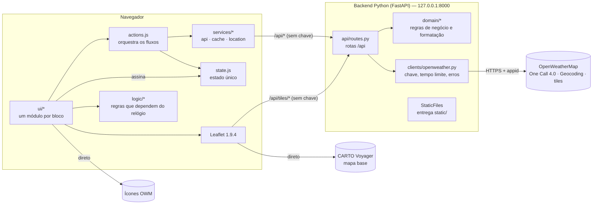
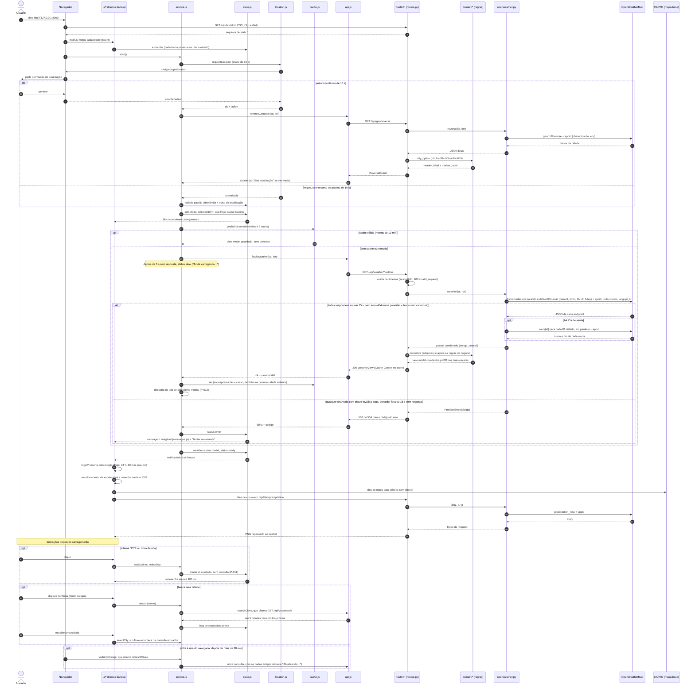

# Arquitetura — OpenWeather Dashboard (MVP)

Define **como** o produto especificado em [spec.md](spec.md) é construído: stack, decisões, contratos, convenções, testes e ordem de implementação. Serve de guia tanto para pessoas quanto para a IA que gera o código.

## Como usar este documento

- **Precedência:** [constitution.md](constitution.md) > [spec.md](spec.md) > este documento > print de referência. Se algo aqui contrariar o spec ou a constitution, corrija este documento.
- **Print de referência** ([referencia/referencia_visual.png](referencia/referencia_visual.png)): define layout, proporções e cores. Textos, idioma, formatos de número, hora e unidade seguem o spec. O print está em inglês, com hora em AM/PM e "E" para leste, e nada disso vale.
- **Para gerar código:** leia as seções 3 (decisões), 5 (estrutura e regras de dependência), 6 (contratos), 7 (detalhes) e 8 (convenções) e implemente **uma fatia por vez** da seção 10, seguindo as tarefas de [tasks.md](tasks.md) e cumprindo a definição de pronto da seção 9.4.
- **Mudanças:** um contrato (seção 6) só muda se este documento for atualizado antes do código. Uma dependência nova só entra com um ADR novo na seção 3.

## Sumário

1. [Contexto técnico](#1-contexto-técnico)
2. [Visão geral](#2-visão-geral)
3. [Decisões de arquitetura (ADR)](#3-decisões-de-arquitetura-adr)
4. [Conformidade com a constitution](#4-conformidade-com-a-constitution)
5. [Estrutura do projeto e regras de dependência](#5-estrutura-do-projeto-e-regras-de-dependência)
6. [Contratos](#6-contratos)
7. [Decisões de detalhe](#7-decisões-de-detalhe)
8. [Convenções de código e guardrails](#8-convenções-de-código-e-guardrails)
9. [Estratégia de testes e definição de pronto](#9-estratégia-de-testes-e-definição-de-pronto)
10. [Plano de implementação em fatias](#10-plano-de-implementação-em-fatias)
11. [Guia rápido de execução](#11-guia-rápido-de-execução)
12. [Matriz de rastreabilidade](#12-matriz-de-rastreabilidade)
13. [Riscos e limitações](#13-riscos-e-limitações)

---

## 1. Contexto técnico

| Item | Definição |
|---|---|
| Tipo de projeto | Aplicação web de página única, com backend próprio, executada **só localmente** |
| Linguagem do backend | Python **3.13.5**, em ambiente conda `openweather-dashboard` (Anaconda já instalado) |
| Linguagem do frontend | HTML, CSS e JavaScript puro (ES2022, módulos ES nativos), **sem build** |
| Framework do backend | FastAPI 0.142.2 executado pelo Uvicorn 0.54.0 |
| Cliente HTTP | httpx 0.28.1 (assíncrono) |
| Configuração | `.env` lido pelo python-dotenv 1.2.4 (`uvicorn --env-file .env`) |
| Mapa | Leaflet **1.9.4** (arquivos copiados para `static/vendor/leaflet-1.9.4/`) + mapa base **CARTO Voyager** + camada de precipitação do OpenWeatherMap |
| Gráficos | SVG gerado pelo próprio JavaScript, sem biblioteca |
| Testes | pytest 9.1.1 e pytest-playwright 0.9.0 (Playwright 1.63.0) usando o **Google Chrome instalado** |
| Qualidade de código | ruff 0.16.10 (lint e formatação do Python) |
| Armazenamento | Nenhum: sem banco de dados, arquivos ou cache no servidor. O cache fica só na memória do navegador (ADR-005) |
| Plataforma alvo | Duas versões mais recentes de Chrome, Edge, Firefox e Safari (RNF-006). Os testes são feitos só no Chrome (limitação L-01, seção 13) |
| Endereço local | `http://127.0.0.1:8000` (só a própria máquina) |
| Metas de desempenho | RNF-001 (3 s), RNF-002 (200 ms), RNF-013 e RNF-026 (100 ms) |
| Restrições | Sem instalar software no sistema. Chave só no `.env` (P-001, P-002). Cota de 1.000 chamadas por dia na One Call 4.0, com 5 chamadas por consulta de clima, mais 1 por alerta (ADR-013) |

**Onde as versões ficam registradas** (fonte da verdade, nessa ordem):

| Arquivo | Conteúdo |
|---|---|
| [environment.yml](../environment.yml) | Python 3.13.5 (build padrão, com GIL) e pip 26.2.1, pelo canal conda-forge |
| [requirements.txt](../requirements.txt) | Dependências de execução, diretas e indiretas, com `==` |
| [requirements-dev.txt](../requirements-dev.txt) | Dependências de teste e qualidade, com `==`. Inclui `requirements.txt` |
| `static/vendor/leaflet-1.9.4/` | Versão do Leaflet no nome da pasta. O hash SHA-256 do `leaflet.js` é registrado no `static/vendor/README.md` na fatia 0 |

As versões foram conferidas em 2026-10-04 com `pip install --dry-run -r requirements-dev.txt` no Python 3.13.5, sem conflitos.

---

## 2. Visão geral

### 2.1 Componentes



**Resumo:** o **Python pensa** e o **JavaScript mostra**.
- O backend guarda a chave, conversa com o OpenWeatherMap, aplica as regras de negócio e devolve um **view model**: dados normalizados com os textos já formatados em pt-BR **nas duas escalas**.
- O frontend guarda o estado e o cache, desenha os blocos e aplica só as regras que dependem do relógio sobre dados em cache (ADR-004).

### 2.2 Sequência: fluxo completo da aplicação

Mostra quem chama quem, em que ordem e com que dados: da abertura da página às interações do usuário. É a visão técnica do fluxo de uso do [product-brief.md](product-brief.md). Cada bloco `alt` ou `opt` corresponde a cenários de teste de ponta a ponta (seção 9). Se um contrato ou fluxo mudar, este diagrama muda junto.



**Como ler:**
- **Etapas 1 a 6, inicialização:** o FastAPI entrega a página, e cada bloco da tela passa a escutar o estado.
- **Localização:** o navegador pede permissão. Se o usuário autorizar, o backend descobre o nome da cidade. Se não, entra Uberlândia com o aviso.
- **Carregamento:**
  - Primeiro, o cache do navegador é consultado.
  - Se não houver dados válidos, a chamada passa pelo backend, que acrescenta a chave, faz as 5 chamadas da One Call 4.0 em paralelo e devolve o view model (ADR-013).
  - Uma resposta que chega depois de o usuário trocar de cidade é descartada.
- **Desenho:** cada bloco recorta os dados pelo relógio e desenha. O mapa base vem direto do CARTO, e a camada de chuva passa pelo backend por causa da chave.
- **Interações:** trocar de escala ou de aba não consulta nada. Uma busca refaz o carregamento. Voltar à aba do navegador depois de mais de 10 min atualiza os dados.
- **Chave:** ela nunca chega ao navegador. Só aparece nas setas que saem de `openweather.py` para o OpenWeatherMap.

---

## 3. Decisões de arquitetura (ADR)

Cada decisão registra o contexto, a escolha e as alternativas descartadas. Uma decisão só muda com um ADR novo que a substitua.

### ADR-001 — Backend em Python com FastAPI
- **Contexto:** o projeto precisa ser em Python, e o navegador só executa JavaScript.
- **Decisão:** backend em Python 3.13 com FastAPI e Uvicorn. Os modelos Pydantic deixam explícitos os contratos de entrada (provedor) e de saída (view model). A documentação automática das rotas fica em `/docs`.
- **Alternativas descartadas:** Flask (sem validação nem modelos tipados nativos e síncrono, o que pesa nas tiles concorrentes); `http.server` da biblioteca padrão (roteamento e validação manuais); Streamlit, NiceGUI e Dash (não reproduzem o layout nem cumprem o teclado e a acessibilidade do spec sem injetar HTML, CSS e JavaScript); PyScript (download de cerca de 10 MB, quebra o RNF-001).

### ADR-002 — Frontend em HTML, CSS e JavaScript puro, sem build
- **Decisão:** módulos ES nativos servidos como arquivos estáticos pelo próprio FastAPI. Sem framework, bundler, TypeScript ou Node.js.
- **Por quê:** o código que está no arquivo é o que roda. A tela tem 6 blocos e um estado só, e o padrão *observer* resolve isso sem framework.
- **Alternativas descartadas:** React com Vite (build, JSX e hooks sem ganho real numa página única); TypeScript (exigiria o Node só para checar tipos).

### ADR-003 — Proxy com a chave só no servidor
- **Decisão:** o navegador nunca chama o OpenWeatherMap diretamente. Todas as chamadas passam por 4 rotas do backend (seção 6.1), que acrescentam o `appid` lido do ambiente. O backend aceita só essas rotas, ou seja, não é um proxy aberto.
- **Por quê:** a chave não aparece no navegador, no código nem nas respostas (P-001, P-002, RNF-004).
- **Alternativa descartada:** chave embutida no JavaScript, visível para qualquer usuário.

### ADR-004 — Regras no backend (padrão BFF), exceto as que dependem do relógio
- **Decisão:** o backend devolve um view model com valores normalizados e **textos prontos nas duas escalas** (`{"c": "20°", "f": "69°"}`). O frontend só escolhe a chave da escala ativa.
- **Ficam no frontend** (`static/js/logic/`), por dependerem do "agora" sobre dados em cache:
  - qual dia é "Hoje" (RN-026)
  - a janela de 24 horas (RN-034)
  - a janela de minutos e os marcos (RN-043, RN-047)
  - o resumo da próxima hora (RN-044)
  - a altura das barras (RN-042)
  - o texto alternativo da curva (RNF-016)
- **Consequências:**
  - A troca °C/°F é instantânea e não faz consulta (P-011, RNF-026, RNF-027).
  - A conversão parte sempre do valor original (P-014), porque o backend formata os dois textos a partir do valor bruto.
  - O backend não depende do relógio: o mesmo JSON de entrada sempre gera o mesmo view model.

### ADR-005 — Cache só na memória do navegador
- **Decisão:** um `Map` em `static/js/services/cache.js`, com chave lat/lon arredondada a 2 casas e validade de 10 minutos (RN-010). O backend não guarda nada entre requisições.
- **Por quê:** um cache no servidor guardaria dados indexados pela localização do usuário depois que a página fosse fechada, o que viola o **P-007** e o RN-010.
- **Alternativa descartada:** cache em memória no backend.

### ADR-006 — Mapa com Leaflet 1.9.4 copiado para o projeto + CARTO Voyager
- **Decisão:**
  - Leaflet 1.9.4 copiado para `static/vendor/leaflet-1.9.4/` e carregado por `<script>` (objeto global `L`).
  - Mapa base: CARTO Voyager.
  - Camada de chuva: tiles do OpenWeatherMap pela rota `/api/tiles/precipitation/...`.
- **Por quê:**
  - O Leaflet é simples e já traz zoom pelo teclado, limites de zoom, atribuição e carregamento só da área visível (RN-048, P-019, RNF-023).
  - O CARTO Voyager é gratuito com atribuição, não usa chave e tem o visual mais próximo do print.
  - Copiar os arquivos evita usar um segundo gerenciador de pacotes (npm).
- **Alternativas descartadas:** MapLibre GL com OpenFreeMap (idêntico ao print, mas mais pesado e com API mais complexa); OpenStreetMap padrão (visual mais carregado); CDN em tempo de execução (dependência externa a mais e versão menos controlada).

### ADR-007 — Gráficos em SVG próprio
- **Decisão:** a curva por hora e as barras por minuto são SVG gerados pelos módulos `ui/hourly.js` e `ui/minutely.js`. A curva usa **interpolação cúbica monotônica** (Fritsch–Carlson), que é suave como no print e nunca passa da mínima ou da máxima reais (RN-039).
- **Por quê:** são poucos elementos (24 pontos, até 60 barras), e as regras do spec ficam simples sem biblioteca: etiquetas agrupadas (RN-038), linha reta com temperaturas iguais (RN-039), teto de 10 mm/h (RN-042), foco pelo teclado (RNF-017, RNF-020) e texto alternativo (RNF-016).
- **Alternativa descartada:** Chart.js ou Plotly (dependência a mais e contornos para cada regra).

### ADR-008 — Ambiente conda com pacotes do pip e versões exatas
- **Decisão:**
  - O ambiente conda `openweather-dashboard`, pelo canal conda-forge, fornece só o Python 3.13.5 e o pip.
  - Os pacotes vêm do pip, com `requirements.txt` e `requirements-dev.txt` fixando **todas** as versões, diretas e indiretas, com `==`.
- **Por quê:**
  - O Anaconda já está instalado e o ambiente não interfere no `base` nem em outros ambientes.
  - O conda-forge dispensa o aceite de termos dos canais `defaults`.
  - Quem não usa conda instala com `python -m venv` + `pip install -r`.
- **Alternativa descartada:** `venv` criado a partir do Python do Anaconda. No Windows, ele pode perder DLLs do conda e quebrar o SSL.

### ADR-009 — Testes com pytest e Playwright no Chrome instalado
- **Decisão:** três níveis (seção 9). Os testes de ponta a ponta usam `pytest-playwright` com `--browser-channel chrome`, sem baixar navegadores, e simulam o `/api` com `page.route`, sem internet nem cota. As funções puras em JavaScript são testadas no próprio Chrome com `page.evaluate`, também sem Node.
- **Alternativas descartadas:** Selenium (mais verboso); Cypress (exige Node); testes só manuais.

### ADR-010 — Execução local, sem banco e sem Docker
- **Decisão:** um único processo (Uvicorn) em `127.0.0.1:8000`, que serve a página e a API. O endereço local é contexto seguro, o que libera a geolocalização do navegador (premissa da feature 1).
- **Alternativas descartadas:** Docker e banco de dados, desnecessários para um produto só de leitura e sem dados persistentes.

### ADR-011 — Identificadores em inglês, interface e comentários em pt-BR
- **Decisão:** nomes de variáveis, funções, arquivos e chaves JSON em inglês. Textos da interface, mensagens, comentários e docstrings em pt-BR. A tabela da seção 8.3 liga cada termo do glossário ao identificador.
- **Por quê:** combina com os campos da API (`feels_like`, `dew_point`) e com o ecossistema, e mantém o produto em pt-BR (P-016).

### ADR-012 — Ilustrações próprias por grupo de condição
- **Decisão:** 7 ilustrações SVG próprias em `static/img/conditions/`: `thunderstorm`, `rain`, `snow`, `mist`, `clear`, `clouds` e `neutral` (RN-017). Ficam sob uma camada escura que garante o contraste do texto branco (RNF-009). Sem fotos e sem imagem de fundo da página.
- **Por quê:** dispensa pesquisar licença de imagens de terceiros (dependência da feature 2) e mantém o contraste sob controle.

### ADR-013 — One Call API 4.0, com 5 chamadas em paralelo por consulta de clima
- **Contexto:** a One Call API 3.0, escolhida na primeira versão desta arquitetura, foi descontinuada pelo fornecedor e não aparece mais para novas assinaturas. Em 2026-10-05, uma chave com a assinatura "One Call by Call" só da 4.0 recebeu 401 na URL da 3.0. A 3.0 tinha sido mantida como "risco aceito" sem verificar se ainda era possível assiná-la, o que tornaria o projeto impossível de reproduzir por quem começasse do zero.
- **Decisão:**
  - A consulta de clima (`GET /api/weather`) faz **5 chamadas em paralelo** (`asyncio.gather`) à One Call 4.0, todas com `lat`, `lon`, `units=metric`, `lang=pt_br` e `appid`:
    - `onecall/current`: dados atuais (1 registro);
    - `onecall/timeline/1min`: por minuto (até 60 registros);
    - `onecall/timeline/1h`, **2 páginas**: `start` = hora UTC cheia atual e `start` + 20 h (até 20 registros cada, até 40 horas no total);
    - `onecall/timeline/1day`: diária (até 10 registros; o produto usa até 8).
  - O cliente combina as respostas num **pacote** com a forma da seção 6.2 (`merge_onecall`, função pura). Assim, o domínio e o view model não dependem da paginação nem dos endereços do provedor.
  - **Política de falha:** a consulta é uma unidade. Qualquer chamada com 401/403, 429, outro erro, JSON inválido, tempo esgotado ou falha de rede faz a consulta inteira falhar com o código da seção 6.4, e nada vai para o cache (RN-011). Um **404 numa previsão** (por minuto, por hora ou diária) é falta de cobertura: o bloco vira `null` e aparece como "indisponível" (RF-038, RF-045). Um 404 nos dados atuais é `provider_unavailable`.
  - **Alertas:**
    - O selo de "Hoje" conta os IDs distintos de `current.alerts` (RN-018). A lista inclui alertas que ainda vão começar, como a lista da 3.0.
    - A previsão diária **não** traz alertas (conferido nas capturas da T-0.8). Para o selo de cada dia (RN-032), o cliente faz uma **segunda rodada**, em paralelo, com `onecall/alert/{id}` para cada ID distinto encontrado em `current`, `timeline/1min` e `timeline/1h`, com o ID codificado na URL. Do detalhe, usa só `start` e `end`. O texto dos alertas continua fora do escopo (feature 2).
    - Um 404 no detalhe gera um alerta sem vigência, que conta em todos os dias (RN-032). Os demais erros seguem a política de falha.
  - **Data de cada dia:** a 4.0 marca cada dia com `dt` às 00:00 UTC da data que ele representa, o mesmo valor para qualquer cidade (conferido nas capturas). A data do dia é a data UTC do `dt`, **sem** somar o fuso. Somar o fuso levaria Uberlândia para o dia anterior.
  - **Primeiro minuto:** a previsão por minuto começa no minuto seguinte ao da consulta (conferido nas capturas). O recorte pelo relógio continua no frontend (RN-047).
  - **Links de paginação:** os campos `next` e `prev` das respostas trazem a URL **com a chave**. Eles nunca são seguidos, registrados em log, repassados ao navegador nem gravados nas fixtures. A segunda página por hora é pedida pelo próprio cliente, com `start`.
  - **Relógio:** o `start` da previsão por hora sai de um relógio injetado no `OpenWeatherClient` (padrão `time.time`), para que os testes o controlem. O domínio continua sem relógio.
- **Consequências:**
  - Cada consulta de clima custa 5 chamadas, mais 1 por alerta, na cota de 1.000 por dia: cerca de 200 consultas por dia em cidades sem alertas. O cache de 10 minutos (RN-010) continua sendo a principal economia.
  - O tempo total da consulta é o da chamada mais lenta de cada rodada, com 15 s de limite em cada chamada (RN-012). Com alertas, há duas rodadas.
  - As fixtures reais passam a ser uma por endpoint e por cidade (seção 9.2).
- **Alternativas descartadas:**
  - Pedir ao suporte acesso à 3.0: depende do fornecedor e mantém o projeto numa versão descontinuada.
  - Seguir os links `next` do provedor: trazem a chave e põem nas mãos de um serviço externo a URL que o backend chama.
  - Chamadas em sequência: somariam os tempos e ameaçariam o RNF-001.
  - Contar os alertas de cada dia pelos IDs dos registros por hora: dispensa chamadas extras, mas só cobre as próximas 40 horas, e os dias seguintes nunca mostrariam selo.
  - Mostrar o selo só na aba "Hoje": dispensa chamadas extras, mas corta o RF-030.
  - Previsão de 15 em 15 minutos: não é usada por nenhuma feature.

---

## 4. Conformidade com a constitution

| Princípio | Mecanismo na arquitetura |
|---|---|
| P-001 | Chave só no `.env`. Ela não aparece em respostas nem em logs: o Uvicorn roda sem log de acesso e os loggers `httpx` e `httpcore` ficam em `WARNING`, porque em `INFO` registram a URL com o `appid` (seção 7.6). Os links `next`/`prev` da One Call 4.0, que trazem a chave, nunca são seguidos nem repassados (ADR-013) |
| P-002 | `app/config.py` lê `OPENWEATHER_API_KEY` do ambiente e falha ao iniciar se ela não existir |
| P-003 | Dados externos entram na tela só por `textContent` ou atributos. `innerHTML` com dados externos é proibido (seção 8.4) |
| P-004 | O backend devolve só códigos de erro (seção 6.4). O frontend os traduz por `messages.js`. Corpo e detalhes do provedor nunca são repassados |
| P-005 | Localização só por `navigator.geolocation` (`services/location.js`) |
| P-006 | Log próprio registra método, modelo da rota (ou caminho sem query) e status. Coordenadas nunca vão para o log, nem as do caminho das tiles |
| P-007 | Nada em `localStorage`, `sessionStorage`, IndexedDB ou cookies. Sem cache no servidor (ADR-005). Respostas de `/api` com `Cache-Control: no-store` |
| P-008 | As coordenadas vão só para `/api/weather`, `/api/geo/reverse` e as tiles do mapa (arredondadas a 2 casas no `/api/weather`) |
| P-009 | A busca não depende da localização e está ativa desde o carregamento |
| P-010 | `cache.js`, validade de 10 min (RN-010) |
| P-011 | View model com as duas escalas. Trocar aba ou escala não chama `services/` |
| P-012 | `selectionId` em `actions.js`: resposta de seleção antiga é descartada |
| P-013 | O backend gera `"—"` para valor ausente e `null` para valores numéricos ausentes (seção 6.3) |
| P-014 | O backend formata as duas escalas a partir do valor bruto. O frontend nunca converte nem arredonda |
| P-015 | `domain/time.py` e `logic/time-window.js` usam `dt + timezone_offset` (RN-015) |
| P-016 | Textos de dados no backend e textos fixos em `messages.js`, todos em pt-BR. `<html lang="pt-BR">` |
| P-017 | Toda unidade vem dentro do texto formatado, ou fica identificada no seletor °C/°F (RN-014) |
| P-018 | Legenda e resumo em texto. Aba e escala ativas com `aria-selected`/`aria-pressed` e destaque além da cor |
| P-019 | Atribuições do CARTO, do OpenStreetMap e do OpenWeather no controle de atribuição do Leaflet |
| P-020 | Cada bloco tem o estado `loading` (seção 6.5) |
| P-021 | Cada bloco renderiza sozinho os estados `error` e `unavailable`. A falha do mapa não afeta os demais |
| P-022 | Catálogo de mensagens com ação sugerida (seção 7.3) |
| P-023 | HTML nativo + padrões ARIA de combobox, tablist e gráfico focável. Testes de teclado no Playwright |
| P-024 | CSS Grid e Flexbox, breakpoints de 360 e 600 px (seção 7.1). Teste de largura no Playwright |
| P-025 | Sem login nem sessão |
| P-026 | A stack aparece só neste documento, nunca nos artefatos de requisitos |
| P-027 | Testes nomeados com RF, RN, RNF ou CA. Commits citam os IDs (seções 8.5 e 9.3) |

---

## 5. Estrutura do projeto e regras de dependência

### 5.1 Pastas e responsabilidades

```
openweather-dashboard/
├── app/                              # Backend Python
│   ├── __init__.py
│   ├── main.py                       # create_app(): FastAPI, rotas, StaticFiles, middleware de log, tratadores de erro
│   ├── config.py                     # Settings: lê OPENWEATHER_API_KEY do ambiente
│   ├── logging_setup.py              # log sem query string; httpx/httpcore em WARNING
│   ├── api/
│   │   └── routes.py                 # /api/weather, /api/geo/search, /api/geo/reverse, /api/tiles/...
│   ├── clients/
│   │   └── openweather.py            # OpenWeatherClient: URLs, appid, tempo limite, 5 chamadas da One Call 4.0, merge_onecall, ProviderError
│   ├── schemas/
│   │   ├── provider.py               # Pydantic: subconjunto das respostas do OpenWeatherMap (entrada)
│   │   └── view.py                   # Pydantic: view model e respostas de /api (saída = contrato com o frontend)
│   └── domain/                       # Regras puras: sem rede, sem FastAPI, sem relógio
│       ├── formatting.py             # números pt-BR, sem "-0" (RN-014, RN-020 a RN-025)
│       ├── units.py                  # °F e mph (RN-053 a RN-055)
│       ├── time.py                   # hora local, rótulos de hora, dia e data (RN-015, RN-028, RN-030, RN-035)
│       ├── conditions.py             # grupo de condição, rosa dos ventos, vento calmo (RN-017, RN-019)
│       ├── alerts.py                 # selo e alertas por dia (RN-018, RN-032)
│       ├── precipitation.py          # chance, volume e faixa de intensidade (RN-036, RN-037, RN-041)
│       ├── places.py                 # rótulos de cidade (RN-006 a RN-008, RN-050)
│       └── view_model.py             # monta o view model a partir do JSON bruto
├── static/                           # Frontend (servido em /)
│   ├── index.html
│   ├── css/
│   │   ├── tokens.css                # cores, espaçamentos, raios, breakpoints (seção 7.1)
│   │   └── styles.css                # layout e componentes
│   ├── img/conditions/               # 7 SVG próprios (ADR-012)
│   ├── vendor/
│   │   ├── README.md                 # origem, versão e SHA-256 dos arquivos copiados
│   │   └── leaflet-1.9.4/            # leaflet.js, leaflet.css, images/
│   └── js/
│       ├── main.js                   # ponto de entrada: monta os blocos e inicia o fluxo de localização
│       ├── state.js                  # estado único: getState, setState, subscribe
│       ├── actions.js                # selectCity, retry, search, selectDay, setScale, refreshIfStale
│       ├── messages.js               # todos os textos fixos da interface (seção 7.3)
│       ├── services/
│       │   ├── api.js                # chamadas ao /api: tempo limite, "Ainda carregando…", erros
│       │   ├── cache.js              # Map com validade de 10 min
│       │   └── location.js           # geolocalização com prazo de 10 s
│       ├── logic/                    # funções puras que dependem do relógio (ADR-004)
│       │   ├── time-window.js        # cityToday, visibleDays, hourlyWindow, minuteWindow, minuteMarks
│       │   ├── summaries.js          # minuteSummary, hourlyAltText
│       │   └── chart-math.js         # monotonePath, barHeight, groupRainLabels
│       └── ui/                       # um módulo por bloco: mount(root)
│           ├── header.js             # título, seletor °C/°F, cidade, busca, aviso de localização
│           ├── day-tabs.js
│           ├── current.js            # card principal + 6 indicadores
│           ├── hourly.js
│           ├── minutely.js
│           ├── map.js
│           └── dom.js                # utilitários: el(), setText(), estados de bloco
├── tests/
│   ├── conftest.py                   # fixtures: carregar JSON, app com cliente simulado, servidor para e2e
│   ├── fakes.py                      # chave falsa e provedor simulado com as capturas reais (FakeProvider)
│   ├── fixtures/                     # respostas reais por endpoint + pacotes variantes (seção 9.2)
│   ├── unit/                         # pytest: app/domain
│   ├── api/                          # pytest + TestClient + httpx.MockTransport
│   └── e2e/                          # pytest-playwright no Chrome
├── docs/
├── .env.example
├── environment.yml
├── requirements.txt
├── requirements-dev.txt
└── pyproject.toml                    # só configuração de ferramentas (pytest, ruff). Não é pacote
```

### 5.2 Regras de dependência (quem pode importar quem)

| Camada | Pode usar | Não pode |
|---|---|---|
| `app/domain/` | Biblioteca padrão e `app/schemas/` | FastAPI, httpx, I/O, `datetime.now()`, variáveis de ambiente |
| `app/clients/` | httpx, `asyncio`, `app/config.py`, relógio injetado (só para o `start` da previsão por hora) | FastAPI, `app/domain/` |
| `app/api/` | FastAPI, `app/clients/`, `app/domain/`, `app/schemas/` | Regra de negócio própria |
| `static/js/logic/` | Nada além de JavaScript puro | DOM, `fetch`, `Date.now()` (recebe `nowSec` por parâmetro) |
| `static/js/services/` | `fetch`, `navigator.geolocation`, `messages.js` | DOM |
| `static/js/actions.js` | `state.js`, `services/`, `messages.js` (rótulos da cidade padrão e "Sua localização") | DOM |
| `static/js/ui/` | DOM, `state.js`, `actions.js`, `logic/`, `messages.js`, Leaflet (só `map.js`) | `fetch`, `services/` diretamente, regra de negócio |

**Testabilidade:** `app/domain/` e `static/js/logic/` são puros e recebem tudo por parâmetro. São os principais alvos dos testes de unidade.

---

## 6. Contratos

### 6.1 Rotas do backend

Todas as rotas `/api` respondem com `Cache-Control: no-store`. Os parâmetros são validados antes de qualquer chamada ao provedor.

| Rota | Parâmetros e validação | Chamada ao provedor | Resposta de sucesso |
|---|---|---|---|
| `GET /` e arquivos | — | — | Arquivos de `static/` (`index.html` em `/`) |
| `GET /api/weather` | `lat` float em [-90, 90]; `lon` float em [-180, 180] | 5 chamadas em paralelo a `https://api.openweathermap.org/data/4.0/onecall/`: `current`, `timeline/1min`, `timeline/1h` (2 páginas, com `start`) e `timeline/1day`, todas com `lat&lon&units=metric&lang=pt_br&appid` (RN-059). Depois, `alert/{id}?appid` para cada ID de alerta distinto (ADR-013) | `200` + `WeatherView` (6.3) |
| `GET /api/geo/search` | `q` string; depois de remover espaços das pontas, de 2 a 100 caracteres (RN-004) | `GET https://api.openweathermap.org/geo/1.0/direct?q&limit=5&appid` | `200` + `CitySearchResult` (6.3) |
| `GET /api/geo/reverse` | `lat`, `lon` como em `/api/weather` | `GET https://api.openweathermap.org/geo/1.0/reverse?lat&lon&limit=1&appid` | `200` + `ReverseResult` (6.3) |
| `GET /api/tiles/precipitation/{z}/{x}/{y}.png` | `z` inteiro em [0, 18]; `x` e `y` inteiros em [0, 2^z − 1] | `GET https://tile.openweathermap.org/map/precipitation_new/{z}/{x}/{y}.png?appid` | `200`, `image/png`, bytes repassados |

- **Tempo limite:** 15 s por chamada ao provedor (RN-012), aplicado no `httpx.AsyncClient`. As 5 chamadas do `/api/weather` correm em paralelo, e o detalhe dos alertas corre numa segunda rodada também em paralelo.
- **Falha parcial:** o `/api/weather` segue a política de falha do ADR-013. Qualquer erro numa das chamadas derruba a consulta inteira, e um 404 numa previsão vira bloco `null`.
- **Cliente HTTP:** um único `httpx.AsyncClient`, criado no `lifespan` do FastAPI e fechado no encerramento.
- **Documentação automática:** `/docs` (Swagger) e `/openapi.json` ficam ativos. Só existem localmente.

### 6.2 Dados de entrada (subconjunto do OpenWeatherMap)

Modelados em `app/schemas/provider.py`, com **todos os campos opcionais** e campos extras ignorados (`extra="ignore"`). Um campo ausente ou fora do formato vira `None` e é tratado pelas regras, nunca causa erro 500 (cenários de categoria 5 do spec).

**One Call 4.0** (`units=metric`, `lang=pt_br`). Cada endpoint devolve `lat`, `lon`, `timezone`, `timezone_offset` e uma lista `data`. O cliente combina as respostas num **pacote** (`merge_onecall`), que é a entrada do view model:

```json
{
  "timezone_offset": -10800,
  "current": { "...": "data[0] de onecall/current" },
  "minutely": [ "... data de timeline/1min" ],
  "hourly": [ "... data das 2 páginas de timeline/1h, sem repetir dt" ],
  "daily": [ "... data de timeline/1day" ],
  "alerts": [ { "id": "urn:oid:...", "start": 1791190500, "end": 1791255540 } ]
}
```

- `timezone_offset` vem da resposta de `current`.
- `minutely`, `hourly` ou `daily` ficam **ausentes** do pacote quando o endpoint responde 404 ou devolve `data` vazia.
- Os campos `next` e `prev` são descartados (trazem a chave).
- `alerts` traz o detalhe de cada ID distinto encontrado em `current`, `minutely` e `hourly`. Um ID cujo detalhe respondeu 404 entra só com `id`. Sem IDs, `alerts` fica ausente.

Campos usados:

| Campo | Unidade | Usado em |
|---|---|---|
| `timezone_offset` | s em relação ao UTC | Todas as horas locais (RN-015) |
| `current.dt` | Unix UTC | Hora da medição (RF-016) |
| `current.temp`, `current.feels_like`, `current.dew_point` | °C | Card principal, Ponto de orvalho (RN-014, RN-016, RN-024) |
| `current.humidity` | % | Umidade (RN-020) |
| `current.pressure` | hPa | Pressão (RN-022) |
| `current.uvi` | índice | Índice UV (RN-023) |
| `current.visibility` | m (máx. 10.000) | Visibilidade (RN-021) |
| `current.wind_speed`, `current.wind_deg` | m/s, graus | Vento (RN-019) |
| `current.weather[0].id`, `.description`, `.icon` | código, texto, código do ícone | Grupo de condição, descrição, ícone (RN-016, RN-017) |
| `current.alerts` | lista de IDs (texto) | Selo de alertas do momento atual (RN-018) |
| `minutely[].dt`, `minutely[].precipitation` | Unix UTC, mm/h | Previsão por minuto (RN-041 a RN-047) |
| `hourly[].dt`, `.temp`, `.pop`, `.rain.1h`, `.weather[0].icon`, `.weather[0].description` | Unix, °C, fração 0–1, mm/h, código, texto | Previsão hora a hora (RN-034 a RN-040) |
| `daily[].dt` | Unix UTC, sempre 00:00 UTC da data do dia | Data do dia (RN-026, RN-028, RN-030) |
| `daily[].temp.max`, `.temp.min`, `.feels_like.day`, `.humidity`, `.visibility`, `.pressure`, `.dew_point`, `.uvi`, `.wind_speed`, `.wind_deg`, `.weather[0]` | como acima | Abas e resumo do dia (RN-027 a RN-033). `visibility` não veio nas capturas e mostra "—" (RN-031) |
| `alerts[].id`, `alerts[].start`, `alerts[].end` | texto, Unix UTC | Selo de alertas por dia (RN-032). Os demais campos do detalhe são ignorados |

**Geocoding** (direta e reversa): `name`, `local_names.pt`, `state`, `country`, `lat`, `lon`.

### 6.3 Respostas do backend (view model)

Modeladas em `app/schemas/view.py`. As chaves JSON são em `snake_case`, iguais aos atributos Pydantic, sem aliases.

**Convenções do view model:**
- `Scaled` = objeto `{"c": str, "f": str}` com o texto pronto nas duas escalas.
- Texto de um valor ausente = `"—"` (P-013). Número ausente = `null`. Um rótulo com prefixo mantém o prefixo: `"Sensação de —"`, `"Mín. —"` e `"08:18 — —"` (D-15).
- Pacote sem `timezone_offset`: `daily`, `hourly` e `minutely` = `null` e `current.time_label` = `"—"`. Sem o fuso não há como achar a hora local nem o "Hoje" (P-013, P-015, D-15).
- Um registro de previsão sem `dt` é descartado, porque não há como posicioná-lo no tempo. Se nenhum sobrar, o bloco vira `null`.
- Bloco ausente no pacote (`daily`, `hourly` ou `minutely`, por 404 ou lista vazia do endpoint) = `null`, o que leva o frontend a mostrar "indisponível". Lista vazia no pacote também vira `null`.
- `daily` traz todos os dias recebidos, sem corte. O recorte de "Hoje" e o limite de 8 dias a partir dele ficam no `visibleDays` do frontend (RN-026, RN-027). Cortar no backend a partir do primeiro dia recebido tiraria um dia válido quando esse primeiro dia já é passado na cidade (D-14).
- `alerts_label` = `null` quando não há alertas, e o selo fica oculto (RF-019).

**`WeatherView`** — exemplo com Uberlândia às 08:18 locais:

```json
{
  "timezone_offset": -10800,
  "current": {
    "dt": 1791112680,
    "time_label": "08:18",
    "temp": { "c": "20°", "f": "69°" },
    "feels_like": { "c": "Sensação de 21°", "f": "Sensação de 69°" },
    "description": "Nublado",
    "condition_group": "clouds",
    "icon": "04d",
    "alerts_label": "3 alertas",
    "indicators": {
      "wind": { "c": "4 m/s L", "f": "9 mph L" },
      "humidity": "94%",
      "visibility": "10 km",
      "pressure": "1015 hPa",
      "uvi": "2 UV",
      "dew_point": { "c": "19 °C", "f": "66 °F" }
    }
  },
  "daily": [
    {
      "local_date": "2026-10-08",
      "weekday_label": "Qui",
      "date_label": "Qui, 08/10",
      "max": { "c": "35°", "f": "95°" },
      "min_label": { "c": "Mín. 21°", "f": "Mín. 71°" },
      "feels_like": { "c": "Sensação de 36°", "f": "Sensação de 97°" },
      "description": "Céu limpo",
      "condition_group": "clear",
      "icon": "01d",
      "alerts_label": null,
      "indicators": {
        "wind": { "c": "3 m/s NE", "f": "7 mph NE" },
        "humidity": "40%",
        "visibility": "—",
        "pressure": "1012 hPa",
        "uvi": "9 UV",
        "dew_point": { "c": "14 °C", "f": "57 °F" }
      }
    }
  ],
  "hourly": [
    {
      "dt": 1791111600,
      "hour_label": "08:00",
      "weekday_label": null,
      "temp": { "c": "20°", "f": "69°" },
      "temp_value": { "c": 20.4, "f": 68.72 },
      "pop": "21%",
      "rain_value": 0.21,
      "rain_label": "0,21 mm/h",
      "icon": "10d",
      "description": "Chuva leve"
    }
  ],
  "minutely": [
    {
      "dt": 1791112680,
      "time_label": "08:18",
      "intensity": 0.3,
      "band": "light",
      "tooltip": "08:18 — 0,30 mm/h"
    }
  ]
}
```

**Regras de cada campo:**

| Campo | Regra |
|---|---|
| `time_label`, `hour_label` | `HH:MM` e `HH:00` no fuso da cidade (RN-015, RN-035) |
| `daily[].local_date` | Data `AAAA-MM-DD` do `dt` **em UTC, sem somar o fuso**, porque a 4.0 marca cada dia às 00:00 UTC da data que ele representa (ADR-013). Usada pelo frontend para achar "Hoje" (RN-026). `weekday_label` e `date_label` do dia usam essa mesma data, ou seja, as funções de `time.py` recebem `offset = 0` para `daily` |
| `daily[].weekday_label` | Dom, Seg, Ter, Qua, Qui, Sex ou Sáb (RN-028). O rótulo "Hoje" é decidido pelo frontend |
| `daily[].date_label` | `"Seg, 05/10"` (RN-030) |
| `daily[].alerts_label` | Contagem dos alertas do pacote cuja vigência alcança o dia (RN-032), no formato de RN-018 |
| `current.alerts_label` | Contagem dos IDs distintos em `current.alerts` (RN-018) |
| `daily[].indicators.visibility` | RN-021 quando o dia traz `visibility`. `"—"` quando não traz (RN-031) |
| `hourly[].weekday_label` | Dia da semana abreviado só na hora `00:00` local. Nas demais, `null` (RN-035) |
| `hourly[].temp_value` | Números sem arredondar, nas duas escalas. Servem **só** para posicionar a curva |
| `hourly[].pop` | RN-036. `"—"` se ausente |
| `hourly[].rain_value` / `rain_label` | RN-037. `rain_label` é `null` quando o valor arredondado é 0 ou ausente |
| `minutely[].intensity` | mm/h. `null` se ausente, negativo ou não numérico (RN-047) |
| `minutely[].band` | `none` (p = 0), `light` (0 < p ≤ 0,5), `moderate` (0,5 < p ≤ 2,5), `heavy` (2,5 < p ≤ 7,5), `extreme` (p > 7,5) ou `null` (RN-041) |
| `minutely[].tooltip` | RN-045. Com intensidade `null`: `"08:18 — —"` |
| `condition_group` | `thunderstorm`, `rain`, `snow`, `mist`, `clear`, `clouds` ou `neutral` (RN-017) |
| `indicators.wind` | RN-019. "Calmo" nas duas escalas se a velocidade original for menor que 0,5 m/s. Sem direção, só a velocidade |

**`CitySearchResult`** — `GET /api/geo/search`:

```json
{
  "results": [
    {
      "lat": -18.9186,
      "lon": -48.2772,
      "list_label": "Uberlândia, Minas Gerais, BR",
      "header_label": "Uberlândia, BR",
      "marker_label": "Uberlândia"
    }
  ],
  "truncated": false
}
```

- Os rótulos seguem RN-006 a RN-008 e RN-050.
- `truncated` é `true` quando o provedor devolve **exatamente 5** cidades. Isso aciona a dica "Mostrando as 5 primeiras…". O provedor limita a busca a 5 itens e não informa se existem mais, então essa é a melhor aproximação possível.
- Sem resultados: `results` vazio.

**`ReverseResult`** — `GET /api/geo/reverse`: `{"result": <mesmo item de results> | null}`. Com `null`, o frontend usa "Sua localização" (RN-009, RN-050).

### 6.4 Erros do backend

Formato único: `{"error": "<código>"}`. Detalhes técnicos e respostas do provedor nunca são repassados (P-004).

| Situação | HTTP | `error` |
|---|---|---|
| Parâmetro inválido (substitui o 422 padrão do FastAPI) | 400 | `invalid_request` |
| Provedor respondeu 401 ou 403 (chave inválida ou sem assinatura) | 502 | `provider_unauthorized` |
| Provedor respondeu 429 | 502 | `provider_rate_limited` |
| Provedor respondeu outro erro (4xx ou 5xx) ou resposta não é JSON válido | 502 | `provider_unavailable` |
| Provedor respondeu 404 numa previsão (`timeline/1min`, `1h` ou `1day`) | — | Não é erro: o bloco vira `null` (ADR-013) |
| Passaram 15 s sem resposta (`httpx.TimeoutException`) | 504 | `provider_timeout` |
| Falha de DNS ou de conexão (`httpx.ConnectError`), indício de falta de internet | 502 | `network_unavailable` |

Quando várias das 5 chamadas do `/api/weather` falham, prevalece o primeiro código nesta ordem: `provider_unauthorized`, `provider_rate_limited`, `provider_timeout`, `network_unavailable`, `provider_unavailable`. A ordem dá ao usuário a causa mais acionável.

A tradução de cada código para a mensagem do spec fica na seção 7.3.

### 6.5 Estado do frontend (`state.js`)

```js
/**
 * @typedef {{ lat: number, lon: number, headerLabel: string, markerLabel: string,
 *             source: 'geolocation' | 'default' | 'search' }} City
 * @typedef {'idle'|'loading'|'slow'|'ready'|'refreshing'|'error'} WeatherStatus
 */
const initialState = {
  city: null,              // City | null
  selectionId: 0,          // aumenta a cada troca de cidade (P-012)
  scale: 'c',              // 'c' | 'f' (RF-054). Nunca persistido (RN-058)
  selectedDay: null,       // local_date da aba ativa. null = "Hoje" (RF-025, RF-031)
  weather: null,           // WeatherView | null
  weatherStatus: 'idle',   // 'slow' = mais de 3 s ("Ainda carregando…", RN-012)
  weatherError: null,      // código da seção 6.4 | 'server_unreachable' | null
  fetchedAt: null,         // ms do recebimento, para RF-014
  locationNotice: false,   // aviso de cidade padrão (RF-003, RN-002)
  search: { status: 'idle', results: [], truncated: false, message: null }
                           // status: 'idle' | 'loading' | 'open' | 'empty' | 'error'
};
```

**Estado de cada bloco** (derivado, nunca guardado):
- `loading` ou `slow` → indicador de carregamento
- `error` → mensagem + "Tentar novamente"
- `ready` com a parte do bloco `null` → "indisponível"
- `refreshing` → dados antigos visíveis + "Atualizando…" (caso de borda 8 da feature 1)

### 6.6 Interfaces dos módulos

Assinaturas mínimas. A implementação pode ter funções auxiliares privadas a mais, mas as públicas são estas.

**Backend (`app/`)**

| Módulo | Funções e classes públicas |
|---|---|
| `domain/formatting.py` | `format_number(value: float, decimals: int = 0) -> str` (vírgula, sem "-0", empate em 0,5 para longe do zero); `format_temp(celsius: float \| None, scale: Scale, with_unit: bool = False) -> str` |
| `domain/units.py` | `celsius_to_fahrenheit(c: float) -> float`; `ms_to_mph(v: float) -> float` |
| `domain/time.py` | `local_datetime(ts: int, offset: int) -> datetime`; `time_label(ts, offset) -> str`; `hour_label(ts, offset) -> str`; `weekday_label(ts, offset) -> str`; `date_label(ts, offset) -> str`; `local_date(ts, offset) -> str` |
| `domain/conditions.py` | `condition_group(code: int \| None) -> ConditionGroup`; `wind_direction(deg: float \| None) -> str \| None`; `wind_label(speed_ms: float \| None, deg: float \| None) -> Scaled` |
| `domain/alerts.py` | `alerts_label(count: int) -> str \| None`; `count_alert_ids(ids: list[str] \| None) -> int` (IDs distintos e não vazios; lista ausente = 0); `count_alerts_on_day(alerts: list[Alert], local_date: str, offset: int) -> int` (RN-032) |
| `domain/precipitation.py` | `pop_label(pop: float \| None) -> str`; `rain_label(mm: float \| None) -> str \| None`; `intensity_band(p: float \| None) -> Band \| None`; `minute_tooltip(ts, offset, p) -> str` |
| `domain/places.py` | `city_option(raw: GeoResult) -> CityOption` |
| `domain/view_model.py` | `build_weather_view(raw: OneCallBundle) -> WeatherView`; `build_search_result(raw: list[GeoResult]) -> CitySearchResult` |
| `clients/openweather.py` | `class OpenWeatherClient(http, api_key, clock=time.time)` com `async weather(lat, lon) -> dict` (as 5 chamadas do ADR-013 e o detalhe dos alertas, devolvendo o pacote), `async geocode(q) -> list[dict]`, `async reverse(lat, lon) -> list[dict]`, `async tile(z, x, y) -> bytes`. Levanta `ProviderError(code)` com os códigos de 6.4. Função pura `merge_onecall(current, minutely, hourly_pages, daily, alerts) -> dict`, em que cada argumento é a resposta do endpoint ou `None` (404), e `alerts` é a lista de detalhes |
| `main.py` | `create_app(client: OpenWeatherClient \| None = None) -> FastAPI`. Os testes injetam um cliente com `httpx.MockTransport` |

`Scale = Literal["c", "f"]`, `ConditionGroup` e `Band` são `Literal` com os valores da seção 6.3.

**Frontend (`static/js/`)**

| Módulo | Exportações |
|---|---|
| `state.js` | `getState()` (estado congelado), `setState(patch)`, `subscribe(listener(state, previous)) -> unsubscribe` |
| `actions.js` | `DEFAULT_CITY`, `start()`, `selectCity(city)`, `retry()`, `search(term)`, `closeSearch()`, `selectDay(localDate \| null)`, `setScale(scale)`, `refreshIfStale(nowMs)` |
| `messages.js` | `MESSAGES` (catálogo congelado, seção 7.3), `weatherErrorMessage(code)` (código desconhecido ou ausente → mensagem de `provider_unavailable`) |
| `services/api.js` | `fetchWeather(lat, lon)`, `searchCities(q)`, `reverseGeocode(lat, lon)`, todas devolvendo `{ ok: true, data } \| { ok: false, error }` |
| `services/cache.js` | `roundCoord(value)` (2 casas, sem "-0.00"), `cacheKey(lat, lon)`, `get(key, nowMs) -> { value, storedAt } \| null`, `set(key, value, nowMs)` |
| `services/location.js` | `requestLocation({ timeoutMs, onLate }) -> Promise<{ status: 'ok', lat, lon } \| { status: 'unavailable' }>` |
| `logic/time-window.js` | `cityToday(nowSec, offset)`, `visibleDays(daily, nowSec, offset)` (descarta os dias passados e limita a 8, RN-026 e RN-027), `hourlyWindow(hourly, nowSec)`, `minuteWindow(minutely, nowSec)`, `minuteMarks(window)` |
| `logic/summaries.js` | `minuteSummary(window)`, `hourlyAltText(window, scale)` |
| `logic/chart-math.js` | `monotonePath(points)`, `barHeight(intensity, maxPx, minPx)`, `groupRainLabels(items, minGapPx)` |
| `ui/dom.js` | `el(tag, { class, text, attrs, on }, children)`, `setText(node, text)`, `blockState(state, { part, unavailable }) -> { kind, message? }` (seção 6.5), `renderBlockState(block, view, { onRetry })` (`data-block-state`, `aria-busy` e o `.block-state` com indicador, mensagem ou "Tentar novamente") |
| `ui/*.js` (blocos) | `mount(rootElement)` |

---

## 7. Decisões de detalhe

Pontos que o spec deixa em aberto. Ficam decididos aqui para a IA não precisar adivinhar.

### 7.1 Tokens visuais (`static/css/tokens.css`)

Cores extraídas do print e ajustadas quando necessário para cumprir o contraste do spec. Os contrastes foram calculados pela fórmula da WCAG 2.1.

| Token | Valor | Uso | Contraste |
|---|---|---|---|
| `--color-page-bg` | `linear-gradient(180deg, #3f5f6d 0%, #6b7f86 55%, #8a6f62 100%)` | Fundo da página (substitui a foto do print) | — |
| `--color-on-page` | `#ffffff` | Título e cidade no cabeçalho | ≥ 6,5:1 sobre o topo do gradiente |
| `--color-surface` | `#ffffff` | Painéis externos | — |
| `--color-surface-soft` | `#faf7f4` | Painel "Previsão hora a hora" | — |
| `--color-tile` | `#f8ede1` | Cards de indicadores, cards de hora, marcos | — |
| `--color-panel-minute` | `#f5f5f4` | Painel da previsão por minuto | — |
| `--color-tab` | `#46626f` (opacidade 0,85) | Abas inativas, com texto branco | 6,5:1 |
| `--color-accent` | `#c2410c` | Aba ativa e selo de alertas, com texto branco. O laranja do print (`#f65c20`) dá só 3,3:1 com texto branco | 5,2:1 |
| `--color-curve` | `#ea580c` | Curva de temperatura | 3,3:1 sobre `--color-surface-soft` |
| `--color-rain-label-bg` | `#d7efec` | Etiquetas de chuva | 14,5:1 com o texto |
| `--color-text` | `#1c1917` | Texto principal | ≥ 14:1 |
| `--color-text-value` | `#0c4a6e` | Valores dos indicadores | 8,2:1 sobre `--color-tile` |
| `--color-text-muted` | `#57534e` | Rótulos dos indicadores | 6,6:1 sobre `--color-tile` |
| `--color-band-none` | `#78716c` | Barra 0 mm/h | 4,4:1 sobre o painel (RNF-019 ≥ 3:1) |
| `--color-band-light` | `#16a34a` | Até 0,5 mm/h | 3,0:1 |
| `--color-band-moderate` | `#166534` | 0,5 a 2,5 mm/h | 6,5:1 |
| `--color-band-heavy` | `#a16207` | 2,5 a 7,5 mm/h. O amarelo do print (`#facc15`) dá só 1,4:1 e reprova no RNF-019 | 4,5:1 |
| `--color-band-extreme` | `#e11d48` | Acima de 7,5 mm/h | 4,3:1 |
| `--color-illustration-overlay` | `rgba(15, 23, 42, 0.45)` | Camada sobre a ilustração do card principal | Garante ≥ 4,5:1 com texto branco (RNF-009) |

| Outro token | Valor |
|---|---|
| Fonte | Pilha do sistema: `system-ui, -apple-system, "Segoe UI", Roboto, sans-serif` (sem fontes externas) |
| Raio dos painéis / cards | 16 px / 10 px |
| Espaçamento base | 4 px (múltiplos de 4) |
| Breakpoint | `600px`: abaixo disso, 2 colunas de indicadores (RNF-011), painel por minuto abaixo do mapa (RNF-021) |
| Largura mínima suportada | 360 px, sem rolagem horizontal da página (P-024) |
| Altura mínima do mapa | 300 px abaixo de 600 px (feature 6, categoria 10) |

**Layout** (do print, de cima para baixo):
1. Cabeçalho numa linha: título, seletor °C/°F, cidade e busca.
2. Faixa de abas.
3. Linha com o card principal e os 6 indicadores à esquerda (cerca de 1/3) e a previsão hora a hora à direita (cerca de 2/3). Os dois blocos usam `flex-wrap` com larguras-base de 300 px e 520 px: ficam lado a lado quando cabem e empilham quando não, sem um segundo breakpoint (de 600 px até cerca de 870 px, ficam empilhados e os indicadores continuam em 3 colunas). A curva e os cards por hora ficam no mesmo contêiner de rolagem, para a curva cobrir sempre as mesmas horas dos cards (RF-034, RF-037).
4. Mapa em largura total, com o painel por minuto sobreposto no canto inferior esquerdo, 24 px acima da borda do mapa, para não cobrir a atribuição do Leaflet (RNF-025).

Abaixo de 600 px, tudo fica empilhado em uma coluna. A partir de 600 px, se o cabeçalho não couber numa linha, a busca desce para a segunda linha.

### 7.2 Mapa

| Item | Decisão |
|---|---|
| Mapa base | `https://{s}.basemaps.cartocdn.com/rastertiles/voyager/{z}/{x}/{y}{r}.png`, subdomínios `abcd` |
| Atribuição | `© OpenStreetMap contributors © CARTO · Dados de precipitação © OpenWeather`, com links. Ela fica no canto inferior direito e o painel por minuto no canto inferior esquerdo, então os dois não se sobrepõem (RNF-025) |
| Camada de chuva | `/api/tiles/precipitation/{z}/{x}/{y}.png`, opacidade 0,6 (RN-049) |
| Zoom | Inicial 6, mínimo 3, máximo 10 (RN-048) |
| Falha do mapa base (RF-051) | Contar `tileload` e `tileerror` da camada base na vista atual. No evento `load`, se houver 0 `tileload` e pelo menos 1 `tileerror`, mostrar "Mapa indisponível no momento." |
| Falha da camada de chuva (RF-052) | No primeiro `tileerror` da camada de chuva, mostrar a faixa "Camada de chuva indisponível no momento.". A faixa some no próximo `load` sem erro |
| Dois dedos (RN-052) | Em telas de toque, `dragging` começa desligado. `touchstart` com 2 toques liga, `touchend` desliga. Com 1 toque, mostra "Use dois dedos para mover o mapa." por 1,5 s |
| Descrição acessível | `aria-label` "Mapa de precipitação centrado em {marker_label}" (RNF-024) |
| Troca de cidade | `setView([lat, lon], 6)` e o marcador é movido (RF-048) |

### 7.3 Catálogo de mensagens (`static/js/messages.js`)

- **Textos fixos:** todos os textos fixos da interface ficam em um único objeto `MESSAGES`, **copiados literalmente** das tabelas "Comportamento em erro e casos de borda" do spec.
- **Textos derivados de dados:** rótulos de cidade, horas e valores vêm prontos do backend.

**Tradução dos códigos de erro:**

| Código | Mensagem (spec, feature 1) |
|---|---|
| `provider_unauthorized` | "O serviço de clima recusou o acesso. Tente novamente mais tarde." |
| `provider_rate_limited` | "Limite de consultas ao serviço de clima atingido. Tente novamente em alguns minutos." |
| `provider_unavailable`, `server_unreachable`, `invalid_request` | "O serviço de clima está indisponível no momento." |
| `provider_timeout` | "O serviço de clima demorou para responder." |
| `network_unavailable` (ou `navigator.onLine === false`) | "Sem conexão com a internet. Verifique sua rede e tente novamente." |
| Qualquer erro em `/api/geo/search` | "Não foi possível buscar cidades agora. Tente novamente." |
| Qualquer erro em `/api/geo/reverse` | Nenhuma mensagem. O cabeçalho mostra "Sua localização" (RN-009) |

`server_unreachable` é gerado pelo `api.js` quando o `fetch` ao próprio backend falha, por exemplo com o servidor parado.

### 7.4 Tempos e fluxos

| Regra | Implementação |
|---|---|
| Prazo de localização de 10 s (RN-002) | `setTimeout` próprio de 10 s a partir de `getCurrentPosition`. A opção `timeout` da API não conta o tempo do pedido de permissão, por isso não é usada. Opções: `{ enableHighAccuracy: false, maximumAge: 600000 }` |
| Localização tardia (RN-003) | O pedido não é cancelado. Se a resposta chegar e `city.source === 'default'`, ela é aplicada. Se não, é descartada |
| "Ainda carregando…" (RN-012) | `setTimeout` de 3 s em `actions.js`, que muda o status para `slow` |
| Tempo limite de 15 s (RN-012) | No backend (httpx). O `api.js` tem uma trava de segurança de 17 s com `AbortController`, tratada como `provider_timeout` |
| Pedidos idênticos (RF-015) | `api.js` guarda as promessas em andamento por URL e devolve a mesma promessa |
| Retorno à página (RF-014) | `visibilitychange` → `refreshIfStale(Date.now())`. Se `fetchedAt` passou de 10 min: status `refreshing`, nova consulta e dados antigos visíveis |
| Aba selecionada após atualização (feature 3, categoria 8) | Mantém `selectedDay` se ele ainda estiver em `visibleDays`. Se não, volta para `null` ("Hoje") |
| Coordenadas do `/api/weather` | Arredondadas a 2 casas, iguais à chave do cache (RN-010, P-008). O marcador do mapa usa as coordenadas originais |

### 7.5 Fuso horário

- **Backend:** `datetime.fromtimestamp(ts + offset, tz=timezone.utc)`, formatado com os métodos UTC. **Nunca** usar o fuso da máquina.
- **Frontend:** `new Date((ts + offset) * 1000)` lido com `getUTC*()`. **Nunca** usar `getHours()` nem `toLocaleString()` sem `timeZone: 'UTC'`.

### 7.6 Logs

| Item | Decisão |
|---|---|
| Log de acesso do Uvicorn | Desligado (`--no-access-log`), porque registra a query string com as coordenadas (P-006) |
| Log próprio | Middleware em `logging_setup.py`: `método rota status duração`. A rota é o modelo da rota encontrada (ex.: `/api/tiles/precipitation/{z}/{x}/{y}.png`), para que os `z/x/y` das tiles, que revelam a área vista no mapa, não vão para o log (P-006). Sem rota encontrada (arquivos estáticos, 404), registra o caminho sem a query string |
| `httpx` e `httpcore` | Nível `WARNING`. Em `INFO` registram a URL completa, com `appid` (P-001) |
| Erros do provedor | Só o código de 6.4 e o status HTTP. Nunca a URL, o corpo ou a chave. As URLs da One Call 4.0 aparecem também nos campos `next`/`prev` das respostas, com a chave, e por isso o corpo nunca é registrado |

---

## 8. Convenções de código e guardrails

### 8.1 Python
- PEP 8, aplicado pelo `ruff format` e pelo `ruff check` (configuração no `pyproject.toml`, linha de 100 colunas).
- Anotações de tipo em todas as funções públicas. Modelos de dados sempre em Pydantic.
- Nomes: `snake_case` para funções, variáveis e módulos; `PascalCase` para classes; `UPPER_CASE` para constantes.
- Docstrings curtas em pt-BR, citando os IDs atendidos (ex.: `"""Rosa de 8 pontos (RN-019)."""`).
- Erros do provedor sempre como `ProviderError(code)`. Tratadores de exceção em `main.py` geram o formato de 6.4.
- Rotas assíncronas (`async def`), porque o httpx é assíncrono.

### 8.2 JavaScript
- ES2022 com módulos ES (`import`/`export`), `const` por padrão e `let` quando necessário. Nunca `var`.
- Nomes: `camelCase` para funções e variáveis; arquivos em `kebab-case.js`.
- JSDoc nas funções exportadas, com tipos e IDs atendidos.
- Os dados do JSON mantêm as chaves `snake_case` do backend (`data.feels_like`). Não converter para `camelCase`.
- Elementos criados com `document.createElement` (helper `el()` em `ui/dom.js`). Texto sempre por `textContent`.
- Cada módulo de `ui/` exporta só `mount(root)` e reage ao estado com `subscribe`.

### 8.3 Termos do glossário → identificadores

| Termo (pt-BR) | Identificador |
|---|---|
| Cidade selecionada | `city` |
| Cidade padrão | `DEFAULT_CITY` |
| Escala ativa | `scale` (`'c'` / `'f'`) |
| Aba de dia / dia selecionado | `selectedDay` (`local_date`) |
| Sensação térmica | `feels_like` |
| Ponto de orvalho | `dew_point` |
| Índice UV | `uvi` |
| Chance de precipitação | `pop` |
| Volume de chuva | `rain_value` / `rain_label` |
| Intensidade de precipitação | `intensity` |
| Faixa de intensidade | `band` |
| Grupo de condição | `condition_group` |
| Selo de alertas | `alerts_label` |
| Marco | `mark` |
| Resumo da próxima hora | `minuteSummary` |
| Aviso de localização | `locationNotice` |
| Estado de erro | `weatherStatus = 'error'` |
| Indisponível ("—") | `MISSING = "—"` |

### 8.4 Guardrails: o que **nunca** fazer

1. Acrescentar dependência (pip ou JavaScript) sem um ADR novo na seção 3.
2. Usar framework, bundler, TypeScript, Node.js ou CDN em tempo de execução. Exceções: tiles do CARTO, tiles do OpenWeatherMap pelo proxy e ícones do OpenWeatherMap.
3. Chamar o OpenWeatherMap a partir do navegador.
4. Usar `innerHTML`, `outerHTML`, `insertAdjacentHTML` ou `document.write` com dados externos (P-003).
5. Usar `localStorage`, `sessionStorage`, IndexedDB ou cookies (P-007).
6. Guardar cache ou qualquer estado entre requisições no backend (ADR-005).
7. Registrar em log a query string, coordenadas, a chave ou respostas do provedor (P-001, P-006).
8. Converter unidades ou arredondar no frontend. Use os textos do view model (`temp_value` serve só para posicionar a curva).
9. Chamar `Date.now()` ou `new Date()` sem argumentos dentro de `logic/` ou de `app/domain/`. O "agora" chega por parâmetro.
10. Escrever texto fixo de interface fora do `messages.js`, ou regra de negócio dentro de `ui/`.
11. Alterar `spec.md` ou `constitution.md` sem decisão explícita do usuário.
12. Escrever a chave real em qualquer arquivo, teste, fixture, commit ou prompt (P-001).
13. Seguir, registrar ou repassar os links `next`/`prev` das respostas do provedor, que trazem a chave (ADR-013).

### 8.5 Commits
Conventional Commits, conforme o [CLAUDE.md](../CLAUDE.md), com os IDs atendidos no corpo da mensagem. Exemplo:

```
feat(minutely): exibir barras por faixa de intensidade

Atende RF-039, RF-040, RN-041, RN-042, CA-027, CA-028.
```

---

## 9. Estratégia de testes e definição de pronto

### 9.1 Níveis

| Nível | Ferramenta | O que cobre | Pasta |
|---|---|---|---|
| Unidade (Python) | pytest | `app/domain/`: formatação, conversões, fuso, rosa dos ventos, faixas, alertas, rótulos e montagem do view model | `tests/unit/` |
| API | pytest + `TestClient` + `httpx.MockTransport` | Rotas, validação, tradução de erros (6.4), ausência da chave nas respostas, `Cache-Control` | `tests/api/` |
| Lógica JavaScript | pytest-playwright + `page.evaluate(import(...))` | `static/js/logic/`: janelas, marcos, resumos, `monotonePath`, `barHeight` | `tests/e2e/test_js_logic.py` |
| Ponta a ponta | pytest-playwright no Chrome (`--browser-channel chrome`) | CAs de interface: localização (permissões e geolocalização simuladas), busca, abas, escala, teclado, larguras de 360 e 600 px, falhas simuladas por `page.route`, relógio controlado por `page.clock` | `tests/e2e/` |
| Fumaça com o provedor real | pytest, marcador `live` | Uma chamada real a cada rota. **Fica de fora por padrão.** Roda manualmente, com a chave no `.env` | `tests/api/test_live.py` |

Os testes de ponta a ponta sobem o backend numa thread (fixture `live_server` no `conftest.py`) e interceptam `/api/*` com as fixtures. Não usam internet nem cota.

### 9.2 Fixtures (`tests/fixtures/`)

| Arquivo | Origem | Uso |
|---|---|---|
| `onecall4/uberlandia/{current,1min,1h_p1,1h_p2,1day}.json` | Captura real, uma por endpoint (fatia 0) | Caso completo. Combinadas por `merge_onecall` num pacote |
| `onecall4/uberlandia/alert_{1,2,3}.json` | Captura real do detalhe dos 3 alertas ativos | RN-032 com vigências reais |
| `onecall4/tokyo/{current,1min,1h_p1,1h_p2,1day}.json` | Captura real | Fuso diferente do usuário (categoria 8) |
| `onecall_no_minutely.json` | Pacote variante do de Uberlândia, sem `minutely` | RF-045, CA-032 |
| `onecall_partial.json` | Pacote variante: sem `hourly`, sem `daily`, campos de `current` ausentes | RF-023, RF-038, CA-014, CA-025 |
| `onecall_alerts.json` | Pacote variante com alertas de vigências controladas | CA-010, CA-021, RN-032 |
| `onecall_minutely_bands.json` | Pacote variante com intensidades de borda (0; 0,3; 0,5; 1,0; 2,5; 5,0; 7,5; 8,0; 12; −1; ausente) | CA-027, CA-028, RN-047 |
| `geo_direct_santa_maria.json`, `geo_direct_empty.json`, `geo_reverse_uberlandia.json` | Captura real | Feature 1 |

**Regras das fixtures:**
- Só cidades públicas, nunca a localização real de alguém (P-006).
- Nenhuma fixture contém a chave. Os campos `next` e `prev` das capturas são removidos, porque trazem a URL com a chave (ADR-013).
- Cada variante tem a origem e a alteração descritas em `tests/fixtures/README.md`.

### 9.3 Nomes dos testes

- **Padrão:** `test_<id>_<comportamento>`, com docstring listando todos os IDs cobertos.
- **Exemplos:** `test_ca_012_wind_shows_speed_and_cardinal`, `test_rn_041_band_boundaries_are_inclusive_on_upper_limit`.
- **Quem não tem CA:** um RN, RF ou RNF sem CA próprio recebe teste com o ID dele sempre que for verificável por código.

### 9.4 Definição de pronto (para cada fatia)

1. Os testes dos IDs da fatia estão escritos e passando: `pytest` (e `pytest -m e2e` quando houver interface).
2. `ruff check .` e `ruff format --check .` sem apontamentos.
3. Nenhum guardrail da seção 8.4 foi violado, e `git grep` pelo valor da chave não encontra nada.
4. Contratos alterados foram atualizados **antes** neste documento.
5. A aplicação sobe com `uvicorn` e a fatia foi conferida visualmente contra o print, quando houver interface.
6. As tarefas concluídas estão marcadas em [tasks.md](tasks.md), com "Onde paramos" e "Progresso" atualizados.
7. Um commit no fim da fatia, em Conventional Commits, com os IDs no corpo. A marcação do item 6 entra nesse mesmo commit, junto com o código.

---

## 10. Plano de implementação em fatias

Cada fatia é pequena, verificável e depende só das anteriores. As tarefas de cada fatia, a fatia em que cada ID é fechado e o ponto de retomada entre sessões ficam em [tasks.md](tasks.md). A coluna "IDs principais" abaixo é só um resumo.

| # | Fatia | Entregas | IDs principais |
|---|---|---|---|
| 0 | Setup | Ambiente conda, `pyproject.toml`, `create_app()` servindo um `index.html` mínimo, Leaflet copiado (com SHA-256), `logging_setup.py`, captura das fixtures reais da One Call 4.0 | P-001, P-002, P-006 |
| 1 | Domínio: formatação e unidades | `formatting.py`, `units.py`, `time.py` | RN-014, RN-015, RN-020 a RN-025, RN-053 a RN-055, CA-009, CA-039, CA-042 |
| 2 | Domínio: regras de clima | `conditions.py`, `precipitation.py`, `alerts.py`, `places.py` | RN-006 a RN-009, RN-017 a RN-019, RN-032, RN-036, RN-037, RN-041, CA-012, CA-015, CA-021 |
| 3 | View model | `schemas/provider.py`, `schemas/view.py`, `view_model.py` com fixtures | Seção 6.3, P-013, CA-013, CA-014 |
| 4 | Cliente e rotas | `OpenWeatherClient` (5 chamadas em paralelo, `merge_onecall`), `routes.py`, tratadores de erro, `Cache-Control` | RF-004, RF-006, RF-013, RN-012, RN-059, seção 6.4, RNF-004 |
| 5 | Estrutura da tela | `index.html`, `tokens.css`, `styles.css` com conteúdo estático, comparados com o print | P-024, RNF-011, RNF-015, RNF-021 |
| 6a | Estado, cache e chamadas ao backend | `state.js`, `actions.js` (`selectCity`, `retry`), `services/api.js`, `services/cache.js`, `messages.js`, `ui/dom.js` | RF-004, RF-005, RF-013, RN-010 a RN-012, CA-008 |
| 6b | Cabeçalho, busca e seletor de escala | `ui/header.js`, `actions.js` (`search`, `closeSearch`, `setScale`) | RF-006 a RF-012, RF-015, RF-053, RF-054, CA-004 a CA-007, CA-044 |
| 6c | Localização inicial e cidade padrão | `services/location.js`, `actions.js` (`start`), aviso de localização | RF-001 a RF-003, RN-001 a RN-003, CA-001 a CA-003 |
| 7 | Condições atuais | `ui/current.js` e ilustrações SVG | Feature 2 (RF-016 a RF-023) |
| 8 | Previsão diária | `ui/day-tabs.js`, `logic/time-window.js` (dias) | Feature 3 (RF-024 a RF-032) |
| 9 | Hora a hora | `ui/hourly.js`, `logic/chart-math.js`, `hourlyAltText` | Feature 4 (RF-033 a RF-038) |
| 10 | Por minuto | `ui/minutely.js`, `minuteWindow`, `minuteMarks`, `minuteSummary` | Feature 5 (RF-039 a RF-045) |
| 11 | Mapa | `ui/map.js` | Feature 6 (RF-046 a RF-052) |
| 12 | Robustez, desempenho e acessibilidade | RF-014 (retorno à página), concorrência, tempos de resposta, privacidade, revisão de teclado e de 360 px | Categorias 7 e 8, RNF-001, RNF-002, RNF-022, RNF-026, P-023, P-024 |
| 13 | Fechamento | CAs restantes de ponta a ponta, fumaça com o provedor real, README e release `v0.1.0` | Todos os CA |

**Modelo de pedido para cada fatia** (use com `/costar`):

```
Implementar a tarefa <T-N.x> da fatia <N> de docs/tasks.md: <nome>.
IDs: <lista da tarefa>. Arquivos: <lista da seção 5.1>.
Escreva primeiro os testes dos IDs, depois o código. Siga os contratos (seção 6),
as decisões de detalhe (seção 7) e os guardrails (seção 8.4).
Ao concluir, marque a tarefa e atualize "Onde paramos" em docs/tasks.md.
O commit sai no fim da fatia.
Cumpra a definição de pronto (seção 9.4) e proponha a mensagem de commit.
```

---

## 11. Guia rápido de execução

Comandos no **Anaconda Prompt**, ou no PowerShell depois de rodar `conda init powershell` uma vez.

```bash
# 1. Criar o ambiente (uma vez) e ativá-lo
conda env create -f environment.yml
conda activate openweather-dashboard

# 2. Configurar a chave
copy .env.example .env        # no Git Bash: cp .env.example .env
# edite o .env e preencha OPENWEATHER_API_KEY

# 3. Rodar a aplicação
uvicorn app.main:app --host 127.0.0.1 --port 8000 --env-file .env --no-access-log --reload
# abra http://127.0.0.1:8000

# 4. Testes e qualidade
pytest -m "not e2e"           # unidade e API (rápidos)
pytest -m e2e                 # ponta a ponta no Chrome instalado
pytest                        # todos, menos os "live"
pytest -m live                # fumaça com o provedor real (usa a cota)
ruff check . && ruff format --check .

# 5. Atualizar o ambiente depois de mudar os requirements
conda env update -f environment.yml --prune
```

**Sem conda:** `python -m venv .venv`, ativar o ambiente e rodar `pip install -r requirements-dev.txt`.

Configuração do `pyproject.toml` (criada na fatia 0):
- `[tool.pytest.ini_options]`: `testpaths = ["tests"]`, `pythonpath = ["."]` (para o comando `pytest` importar o pacote `app`), `markers = ["e2e", "live"]`, `addopts = "-m 'not live' --browser-channel chrome"`
- `[tool.ruff]`: `line-length = 100`, `target-version = "py313"`

---

## 12. Matriz de rastreabilidade

| Feature | Backend | Frontend | Testes |
|---|---|---|---|
| 1. Localização, busca e carregamento | `routes.py`, `openweather.py`, `places.py` | `actions.js`, `services/*`, `ui/header.js` | `tests/api/test_routes_*.py`, `tests/unit/test_places.py`, `tests/e2e/test_f1_location_search.py` |
| 2. Condições atuais | `formatting.py`, `conditions.py`, `alerts.py`, `view_model.py` | `ui/current.js` | `tests/unit/test_formatting.py`, `test_conditions.py`, `tests/e2e/test_f2_current.py` |
| 3. Previsão diária | `time.py`, `alerts.py`, `view_model.py` | `ui/day-tabs.js`, `logic/time-window.js` | `tests/unit/test_alerts.py`, `tests/e2e/test_f3_daily.py`, `test_js_logic.py` |
| 4. Hora a hora | `precipitation.py`, `time.py` | `ui/hourly.js`, `logic/chart-math.js`, `logic/summaries.js` | `tests/unit/test_precipitation.py`, `tests/e2e/test_f4_hourly.py`, `test_js_logic.py` |
| 5. Por minuto | `precipitation.py` | `ui/minutely.js`, `logic/time-window.js`, `logic/summaries.js` | `tests/unit/test_precipitation.py`, `tests/e2e/test_f5_minutely.py`, `test_js_logic.py` |
| 6. Mapa | rota de tiles em `routes.py` | `ui/map.js` | `tests/api/test_routes_tiles.py`, `tests/e2e/test_f6_map.py` |
| 7. Unidades | `units.py`, `formatting.py` (duas escalas) | `state.scale`, `ui/header.js` | `tests/unit/test_units.py`, `tests/e2e/test_f7_units.py` |

---

## 13. Riscos e limitações

| Risco | Impacto | Mitigação |
|---|---|---|
| One Call 4.0 é recente (lançada em junho de 2026) e a documentação tem lacunas | Formato real diferente do documentado | As capturas da T-0.8 já mostraram três diferenças (data do dia, alertas fora da previsão diária e primeiro minuto), registradas no ADR-013 e em `tests/fixtures/README.md`. Ainda não se sabe se `timeline/1min` sem cobertura responde 404 ou lista vazia, e o cliente trata os dois casos. O cliente fica isolado em `clients/openweather.py`, o pacote (`merge_onecall`) isola a paginação, e o view model protege o frontend |
| Cota de 1.000 chamadas por dia, com 5 por consulta de clima mais 1 por alerta | Erro `provider_rate_limited` depois de cerca de 200 consultas no dia (menos em cidades com alertas) | Cache de 10 min, testes sem internet (`page.route` e `MockTransport`), fumaça `live` só manual e limite diário de chamadas configurado na conta do provedor |
| Termos de uso do CARTO | Bloqueio das tiles do mapa base | Uso acadêmico leve, com atribuição. Plano B: OpenStreetMap padrão (troca de uma URL em `ui/map.js`) |
| Cache de tiles de terceiros no navegador | Fica no disco uma região visitada (escala regional), fora do controle da aplicação | `/api` usa `no-store`. As tiles do CARTO seguem os cabeçalhos do CARTO, que mostram a região e não a posição exata. Limitação aceita |
| Leaflet copiado não recebe atualização automática | Correções de segurança manuais | Versão e SHA-256 registrados em `static/vendor/README.md` |
| **L-01:** testes feitos só no Chrome. Edge, Firefox e Safari não são testados, nem em computador nem em celular | O RNF-006 não é verificado fora do Chrome. Diferenças de comportamento nesses navegadores podem passar despercebidas | Limitação aceita no MVP ([tasks.md](tasks.md), L-01). O código usa só APIs padrão do navegador (ES2022, `fetch`, geolocalização) e o Leaflet, que é compatível com os quatro navegadores |
| Atualizações automáticas do Chrome | Testes de ponta a ponta podem mudar de comportamento | O Playwright 1.63 suporta o canal estável. Se quebrar, atualizar o `pytest-playwright` com um ADR |
| Mudança de versão do Python ou de pacotes | Instalação diferente entre máquinas | Todas as versões fixadas (seção 1). `conda env update --prune` |
| Previsão por minuto ausente em muitas cidades | Painel "indisponível" | Comportamento previsto no spec (RF-045) |
