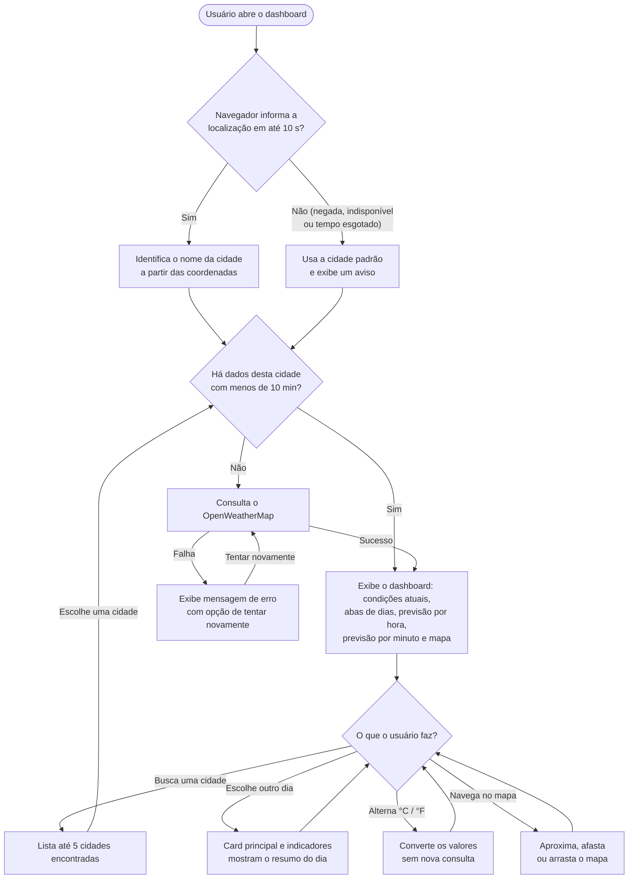

# Product Brief — OpenWeather Dashboard

> **Aviso:** este produto e todos os seus artefatos (product brief, constitution, spec e demais documentos) foram criados **para fins de aprendizado**, como MVP acadêmico de pós-graduação. Por isso, são intencionalmente mais simples do que se espera de um produto real: o escopo é reduzido, não há metas de negócio, os requisitos de segurança e operação são básicos e várias decisões priorizam a clareza didática em vez da completude.

Documentos relacionados: [constitution.md](constitution.md) (princípios) · [spec.md](spec.md) (especificação por feature) · [requisitos.md](requisitos.md) (índice).

---

## 1. O produto

O **OpenWeather Dashboard** é uma página web única que mostra as condições do tempo e a previsão de uma cidade em um painel visual. Ao abrir a página, o produto usa a localização do navegador para mostrar o clima de onde o usuário está. Se a localização não estiver disponível, mostra uma cidade padrão (Uberlândia, BR). O usuário pode buscar qualquer outra cidade pelo nome.

O painel reúne, em uma só tela:

| Bloco | O que mostra |
|---|---|
| Cabeçalho | Título, alternância °C/°F, cidade atual e campo de busca |
| Abas de dias | Hoje e os próximos 7 dias, com temperatura máxima e ícone |
| Card principal | Temperatura, descrição, sensação térmica, hora local e quantidade de alertas |
| Indicadores | Vento, umidade, visibilidade, pressão, índice UV e ponto de orvalho |
| Previsão hora a hora | Curva de temperatura e cards das próximas 24 horas |
| Previsão por minuto | Intensidade da chuva minuto a minuto na próxima hora, com legenda de cores |
| Mapa | Localização da cidade com uma camada de precipitação |

Todos os dados vêm do provedor **OpenWeatherMap**.

## 2. Razão de existir

| Para quem | Problema | Como o produto resolve |
|---|---|---|
| Pessoa que quer saber o tempo | A informação costuma estar espalhada (temperatura num lugar, chance de chuva em outro, radar em outro) ou escondida atrás de cadastro e anúncios | Reúne o essencial em uma tela, sem cadastro, já na localização do usuário |
| Pessoa que vai sair nas próximas horas | Previsões diárias não dizem **quando** vai chover | Mostra a chance de chuva hora a hora e a intensidade minuto a minuto na próxima hora |
| Aluno de pós-graduação (autor) | Precisa praticar o SDLC com apoio de IA Generativa em um caso concreto e pequeno | Serve de caso de estudo para spec-driven development: brief → constitution → spec → arquitetura → implementação |

## 3. Atores

| Ator | Tipo | Relação com o produto |
|---|---|---|
| Usuário | Pessoa (ator principal) | Abre a página, autoriza ou nega a localização, busca cidades, escolhe dias, alterna unidades e navega no mapa. Não precisa de cadastro. |
| Navegador | Sistema (ator de apoio) | Pede ao usuário permissão para a localização e, se ele autorizar, informa as coordenadas do dispositivo. |
| OpenWeatherMap | Sistema externo (ator de apoio) | Fornece os dados meteorológicos, a busca de cidades por nome ou por coordenadas, os ícones e a camada de precipitação do mapa. |
| Provedor de mapa base | Sistema externo (ator de apoio) | Fornece o mapa geográfico sobre o qual ficam a camada de precipitação e o marcador. É escolhido na etapa de arquitetura. |

## 4. Fluxo de uso

## 5. Glossário geral

Termos usados em todos os artefatos. Os termos próprios das features ficam no glossário consolidado do [spec.md](spec.md).

| Termo | Definição |
|---|---|
| Dashboard | A página única do produto, com todos os blocos de informação do tempo. |
| Usuário | Qualquer pessoa que acessa o dashboard. Não há cadastro, login nem perfis. |
| Cidade selecionada | A cidade cujos dados estão sendo exibidos. Pode vir da localização do navegador, da cidade padrão ou de uma busca. |
| Cidade padrão | Uberlândia, BR (lat -18.9186, lon -48.2772). É usada quando a localização do navegador não está disponível. |
| Localização do navegador | Coordenadas aproximadas do dispositivo, informadas pelo navegador somente depois de o usuário autorizar. |
| Coordenadas | Par latitude/longitude que identifica um ponto geográfico. |
| Geocodificação | Conversão entre o nome de uma cidade e suas coordenadas. É **direta** quando parte do nome e **reversa** quando parte das coordenadas. |
| Provedor | Serviço externo que fornece dados: o OpenWeatherMap (clima, geocodificação, ícones e camada de precipitação) e o provedor de mapa base. |
| Chave de API | Credencial secreta que o provedor exige em cada consulta. Nunca aparece em código, documentação ou prompts. |
| Cota | Número máximo de consultas que o provedor aceita em um período. Acima dela, as consultas são recusadas ou cobradas. |
| Cache | Cópia em memória dos dados de uma cidade, reaproveitada por 10 minutos para evitar consultas repetidas. Some quando a página é recarregada. |
| Horário local da cidade | Data e hora no fuso horário da cidade selecionada, que pode ser diferente do fuso do usuário. |
| Condições atuais | Medições do momento atual na cidade selecionada (temperatura, vento, umidade etc.). |
| Previsão diária | Resumo previsto para cada dia: hoje e os próximos 7. |
| Previsão hora a hora | Valores previstos para cada hora das próximas 24 horas. |
| Previsão por minuto | Intensidade de precipitação prevista para cada minuto da próxima hora. Não existe para todas as localidades. |
| Alerta meteorológico | Aviso oficial de evento severo (tempestade, onda de calor etc.) emitido para a região da cidade. |
| Escala de temperatura | Celsius (°C) ou Fahrenheit (°F), escolhida pelo usuário. A velocidade do vento acompanha a escala: m/s com °C e mph com °F. |
| Indisponível ("—") | Marcador exibido no lugar de um valor que o provedor não enviou. |
